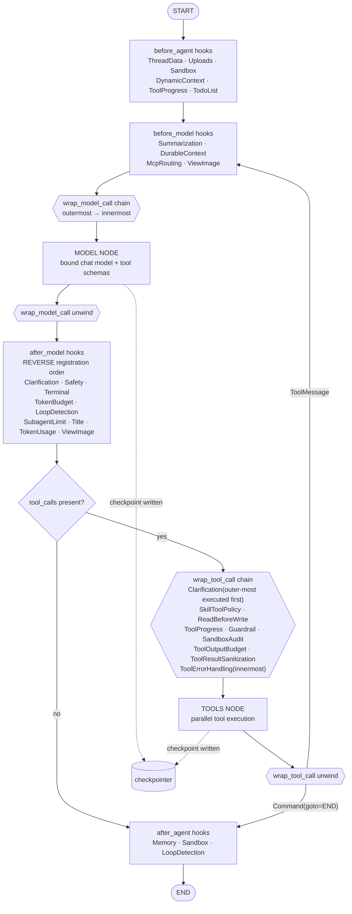

# 01 — How DeerFlow Uses LangGraph

> **Verdict:** DeerFlow uses LangGraph as its *entire* execution substrate. There is no
> parallel/alternative orchestration path. Every agent turn — lead agent, subagent,
> bootstrap agent, embedded client, TUI — is a compiled LangGraph graph invocation.

---

## 1. Import census

Counted across `backend/packages/harness/deerflow/**` and `backend/app/**`:

| Symbol | Package | Uses | Purpose in DeerFlow |
|--------|---------|------|---------------------|
| `AgentMiddleware` | `langchain.agents.middleware` | **36** | Every cross-cutting concern |
| `AgentState` | `langchain.agents` | **27** | Base for `ThreadState` and per-middleware state schemas |
| `Command` | `langgraph.types` | **26** | Tool results that also write state / redirect control flow |
| `ToolMessage` | `langchain_core.messages` | 24 | Tool result construction & rewriting |
| `@tool` | `langchain.tools` | 20 | Tool definitions |
| `Runtime` | `langgraph.runtime` | 19 | Per-run context object (`runtime.context`, `.state`, `.store`) |
| `ToolCallRequest` | `langgraph.prebuilt.tool_node` | 11 | `wrap_tool_call` interception |
| `ModelRequest` / `ModelResponse` / `ModelCallResult` | `langchain.agents.middleware.types` | 9 | `wrap_model_call` interception |
| `create_agent` | `langchain.agents` | **4** | The only graph builder for agents |
| `BaseTool` | `langchain.tools` | 8 | Tool registry typing |
| `InMemorySaver` | `langgraph.checkpoint.memory` | 5 | Dev checkpointer |
| `BaseStore` | `langgraph.store.base` | 4 | Long-term KV store |
| `GraphBubbleUp` | `langgraph.errors` | 4 | Control-flow exceptions that must not be swallowed |
| `get_stream_writer` | `langgraph.config` | 3 | Custom stream-mode events (subagent progress) |
| `Checkpointer` / `BaseCheckpointSaver` | `langgraph.types` / `.checkpoint.base` | 5 | Provider typing |
| `AsyncSqliteSaver` | `langgraph.checkpoint.sqlite.aio` | 2 | SQLite checkpointer |
| `Overwrite` | `langgraph.channels` | 3 | Channel semantics |
| `DeltaChannel` | `langgraph.channels` | 1 | Delta-mode `messages` channel |
| `empty_checkpoint`, `uuid6` | `langgraph.checkpoint.base` | 2 | Rollback / goal-state checkpoint forging |
| `StateGraph` | `langgraph.graph` | **1** | Only for the synthetic state-mutation graph |
| `END` | `langgraph.graph` | 1 | `Command(goto=END)` for clarification interrupts |
| `TodoListMiddleware`, `SummarizationMiddleware` | `langchain.agents.middleware` | 2 | Subclassed by DeerFlow |
| `get_config` | `langgraph.config` | 8 | Ambient `RunnableConfig` access inside hooks |

**Key observation:** `create_agent` appears 4 times and `StateGraph` once. DeerFlow does
**not** author its own agent topology — it configures LangChain's prebuilt agent graph and
puts all its logic in middleware.

---

## 2. The four `create_agent` call sites

| # | Location | Agent | Checkpointer |
|---|----------|-------|--------------|
| 1 | [`agents/lead_agent/agent.py:635`](../../backend/packages/harness/deerflow/agents/lead_agent/agent.py#L635) | **Bootstrap agent** (creates custom agents) | attached by worker |
| 2 | [`agents/lead_agent/agent.py:705`](../../backend/packages/harness/deerflow/agents/lead_agent/agent.py#L705) | **Lead agent** (the main agent) | attached by worker |
| 3 | [`subagents/executor.py:536`](../../backend/packages/harness/deerflow/subagents/executor.py#L536) | **Subagent** | `checkpointer=False` |
| 4 | [`client.py`](../../backend/packages/harness/deerflow/client.py) | **Embedded `DeerFlowClient`** (library/TUI use) | own provider |

### The canonical call — lead agent

```python
# agents/lead_agent/agent.py:705
return create_agent(
    model=create_chat_model(
        name=model_name,
        thinking_enabled=thinking_enabled,
        reasoning_effort=reasoning_effort,
        app_config=resolved_app_config,
        attach_tracing=False,          # tracing attaches at the GRAPH root instead
        model_overrides=agent_model_overrides,
    ),
    tools=final_tools,                 # builtin + config + MCP + ACP + memory + skills
    middleware=normalize_middleware_state_schemas(
        build_middlewares(config, model_name=..., agent_name=..., ...),
        mode,                          # rewrites each middleware's state_schema for delta mode
    ),
    system_prompt=apply_prompt_template(...),   # fully STATIC string
    state_schema=get_thread_state_schema(mode), # ThreadState or DeltaThreadState
)
```

Four inputs, four subsystems:

- `model=` → [`deerflow/models`](../../backend/packages/harness/deerflow/models) — a provider
  registry that wraps `ChatOpenAI`/`ChatAnthropic`/etc. plus custom providers
  (`claude_provider`, `openai_codex_provider`, `mindie_provider`).
- `tools=` → see [05 — Tools & MCP](05-tools-and-mcp.md).
- `middleware=` → see [03 — Middleware Stack](03-middleware-stack.md).
- `state_schema=` → next section.

---

## 3. State schema — `ThreadState`

Defined in [`agents/thread_state.py`](../../backend/packages/harness/deerflow/agents/thread_state.py).
It extends LangChain's `AgentState` (which supplies `messages`) with ten DeerFlow channels,
each with an explicit **reducer**:

```python
class ThreadState(AgentState):
    sandbox:        SandboxStateField                              # Annotated[..., merge_sandbox]
    thread_data:    NotRequired[ThreadDataState | None]            # workspace/uploads/outputs paths
    title:          NotRequired[str | None]
    artifacts:      Annotated[list[str], merge_artifacts]
    todos:          Annotated[list | None, merge_todos]
    goal:           Annotated[GoalState | None, merge_goal]
    uploaded_files: NotRequired[list[dict] | None]
    viewed_images:  Annotated[dict[str, ViewedImageData], merge_viewed_images]
    promoted:       Annotated[PromotedTools | None, merge_promoted]
    delegations:    Annotated[list[DelegationEntry], merge_delegations]
    skill_context:  Annotated[list[SkillEntry], merge_skill_context]
    summary_text:   NotRequired[str | None]
```

### Reducer semantics (why each exists)

| Channel | Reducer | Behaviour |
|---------|---------|-----------|
| `messages` | `add_messages` (LangChain) | Append + id-based replacement; `RemoveMessage` deletes |
| `sandbox` | `merge_sandbox` | **Idempotent-only.** Two different `sandbox_id`s in one super-step → `ValueError`. Fails closed rather than silently picking one (isolation bug detector). |
| `artifacts` | `merge_artifacts` | Order-preserving dedup union |
| `todos` | `merge_todos` | Last-non-`None` wins; `[]` is an explicit clear |
| `goal` | `merge_goal` | Last-non-`None` wins |
| `viewed_images` | `merge_viewed_images` | Dict merge; `{}` is an explicit clear. Stores **metadata only** — image bytes are re-read from disk so checkpoints don't carry base64 (issue #4138) |
| `promoted` | `merge_promoted` | Union **scoped by `catalog_hash`**; a catalog change wipes stale promotions so a persisted tool name can't resolve to a different tool later |
| `delegations` | `merge_delegations` | Upsert by `id`, terminal status never downgraded, capped at 50 entries |
| `skill_context` | `merge_skill_context` | Dedup by path, LRU-refresh on re-read, capped at 8 entries, legacy payload keys stripped |

These reducers are the "multi-writer conflict policy" of the system: parallel tool calls
inside one LangGraph super-step all write to the same channels, and the reducer decides
what merging means for each one.

### Delta mode — swapping the `messages` channel

```python
DELTA_MESSAGES_FIELD = Annotated[
    list[AnyMessage],
    DeltaChannel(merge_message_writes, snapshot_frequency=1000),
]

class DeltaThreadState(ThreadState):
    messages: DELTA_MESSAGES_FIELD

def get_thread_state_schema(mode: CheckpointChannelMode) -> type:
    return DeltaThreadState if mode == "delta" else ThreadState
```

In `full` mode each checkpoint stores the whole message list. In `delta` mode LangGraph
stores per-step writes plus a snapshot every 1000 steps — dramatically smaller checkpoints
for long threads, at the cost of a replay walk on read.

Middleware state schemas are rewritten to match, via `adapt_state_schema_for_mode` +
`normalize_middleware_state_schemas`: each middleware's `state_schema` TypedDict is
regenerated with `messages` replaced by the `DeltaChannel` annotation. Without this, a
middleware declaring `messages` under the plain reducer would fight the delta channel.

---

## 4. `Runtime` — the per-run context object

The worker constructs the LangGraph `Runtime` manually, because it drives the graph via
`astream(config=...)` rather than through `langgraph-cli` (which would do this automatically):

```python
# runtime/runs/worker.py
runtime_ctx = _build_runtime_context(thread_id, run_id, config.get("context"), ctx.app_config)
runtime_ctx["__run_journal"] = journal                 # sentinel channel for middleware audit writes
_install_runtime_context(config, runtime_ctx)
runtime = Runtime(context=cast(Any, runtime_ctx), store=store)
config.setdefault("configurable", {})["__pregel_runtime"] = runtime
```

`runtime.context` is a plain dict that becomes `ToolRuntime.context` inside tools and
`runtime.context` inside middleware hooks. It carries:

| Key | Written by | Read by |
|-----|-----------|---------|
| `thread_id`, `run_id` | worker | almost everything |
| `model_name`, `thinking_enabled`, `reasoning_effort`, `is_plan_mode`, `subagent_enabled`, `max_concurrent_subagents`, `max_total_subagents`, `agent_name`, `is_bootstrap` | gateway `merge_run_context_overrides` | `make_lead_agent`, middlewares |
| `user_id`, `user_role`, `oauth_provider`, `oauth_id`, `is_internal`, `authz_attributes`, `channel_user_id` | gateway `inject_authenticated_user_context` | guardrails, authz, memory, sandbox |
| `github_token`, `disable_clarification` | **runtime-context only**, never `configurable` | bash tool, clarification middleware |
| `stop_reason` | guard middlewares | worker (final run status) |
| `__run_journal` | worker | `SafetyFinishReasonMiddleware` and other auditing middlewares |
| `__slash_skill_*`, `__active_secrets` | skill middlewares | skill tool policy |
| `app_config` | worker | agent factory |

> **Security detail:** `_CONTEXT_RUNTIME_ONLY_KEYS = {"github_token", "disable_clarification"}`
> are written to `config["context"]` but **never** to `config["configurable"]` — because
> `configurable` is persisted into checkpoints, and a short-lived GitHub installation token
> must not be written to the checkpoint store.
> Symmetrically, caller-supplied `__`-prefixed context keys are stripped in `build_run_config`
> so a client cannot forge internal channels (issue #3938).

---

## 5. `Command` — control flow from inside tools and middleware

`Command` is used 26 times. Three distinct patterns:

### (a) Tool result + state write
The `task` tool returns a `Command` that adds the `ToolMessage` *and* appends to the
`delegations` ledger channel in one atomic write.

### (b) Human-in-the-loop interrupt
[`ClarificationMiddleware`](../../backend/packages/harness/deerflow/agents/middlewares/clarification_middleware.py)
intercepts `ask_clarification` in `wrap_tool_call` and returns:

```python
return Command(
    update={"messages": [tool_message]},   # the question, with artifact={"human_input": ...}
    goto=END,                              # stop the graph — do NOT loop back to the model
)
```

The turn ends cleanly with a checkpoint whose last message is the question. The frontend
renders it as a form. The user's answer arrives as a new run on the same thread, so the
checkpoint *is* the interrupt state — no `interrupt()` primitive needed.

### (c) Resume
`POST /runs` with `command: {resume: ...}` is converted by the gateway into
`Command(resume=...)` and passed as the graph input instead of `{"messages": [...]}`.

---

## 6. Streaming — `astream` with multiple modes

```python
# runtime/runs/worker.py :: _stream_once
async for item in agent.astream(
    input_payload,
    config=stream_config,
    stream_mode=lg_modes,        # e.g. ["values", "messages", "custom", "updates"]
    subgraphs=stream_subgraphs,  # frontend sends true → subagent events surface
):
    mode, chunk = _unpack_stream_item(item, lg_modes, stream_subgraphs)
    await bridge.publish(run_id, _lg_mode_to_sse_event(mode), serialize(chunk, mode=mode))
```

Mode mapping between the wire protocol and LangGraph:

| Client `stream_mode` | LangGraph mode | Notes |
|---|---|---|
| `values` | `values` | Full state snapshot per super-step (default) |
| `messages-tuple` | `messages` | Token-level streaming |
| `updates` | `updates` | Per-node state deltas |
| `custom` | `custom` | `get_stream_writer()` payloads — subagent `task_*` events |
| `debug` | `debug` | — |
| `events` | *(skipped)* | Explicitly unsupported: needs `astream_events` + checkpoint callbacks |

`custom` chunks are additionally buffered by `_SubagentEventBuffer` and batch-persisted to
the `run_events` store, so a page reload can replay subagent step history (issue #3779).

---

## 7. Checkpointers and the store

Both are resolved from one `database:` config section
([`config/database_config.py`](../../backend/packages/harness/deerflow/config/database_config.py)):

| `database.backend` | Checkpointer | Store | App persistence |
|---|---|---|---|
| `memory` (default) | `InMemorySaver` | `InMemoryStore` | in-memory repos |
| `sqlite` | `AsyncSqliteSaver` | SQLite store | same `deerflow.db` file, WAL mode |
| `postgres` | `AsyncPostgresSaver` | Postgres store | same URL, independent pools |

Each has a **sync** provider (singleton + context manager, for CLI/TUI) and an **async**
provider (used by the gateway's `langgraph_runtime()` `AsyncExitStack`).

A multi-worker safety gate rejects SQLite when `GATEWAY_WORKERS > 1` — SQLite write locks
cannot support concurrent multi-process access.

Details, including the `full`/`delta` freeze protocol and the `InMemorySaver` upstream bug
patch, are in [06 — Memory, Chat History & Checkpoints](06-memory-checkpoints-state.md).

---

## 8. The single `StateGraph`

```python
# runtime/checkpoint_state.py
def build_state_mutation_graph(as_node: str, mode, state_schema=None):
    builder = StateGraph(state_schema or get_thread_state_schema(mode))
    builder.add_node(as_node, _finish_state_mutation)   # returns {}
    builder.set_entry_point(as_node)
    builder.set_finish_point(as_node)
    return builder.compile()
```

Why: `graph.update_state(..., as_node=X)` requires `X` to be a registered node. DeerFlow
needs to write wholesale state *without scheduling any agent work* — for
`goal_evaluator`, `rollback_restore`, and `manual_compaction` writes. A single-node no-op
graph gives a checkpoint with no pending `next` nodes.

Crucially it must be compiled with the thread's **effective** schema (including
middleware-contributed channels), because *writes to unknown channels are silently discarded*.

---

## 9. Graph topology as actually executed

`create_agent` produces the standard LangChain agent loop. DeerFlow's contribution is
everything hanging off it:



Every arrow crossing a node boundary is a LangGraph **super-step**, and every super-step
writes a checkpoint. That is why the `recursion_limit` (default 100, clamped to
`max_recursion_limit`, default ceiling 1000) is the real bound on a lead-agent turn.

---

## 10. What DeerFlow deliberately does *not* use

| LangGraph feature | Status | Why |
|---|---|---|
| Hand-authored `StateGraph` for agents | **Not used** | `create_agent` + middleware covers it |
| `interrupt()` / `Command(resume=)` for HITL clarification | **Not used for clarification** | Clarification uses `Command(goto=END)` + a new run; `resume` is still wired for generic LangGraph resume |
| `astream_events` | **Not used** | Explicitly skipped in the worker with a log line; needs checkpoint callbacks |
| Subgraph checkpointing for subagents | **Not used** | Subagents run with `checkpointer=False` — ephemeral by design |
| LangGraph Platform hosting | **Not required** | The gateway reimplements the protocol; `langgraph-api`/`-cli` are kept for compatibility |

---

**Next:** [02 — Request Lifecycle](02-request-lifecycle.md)
