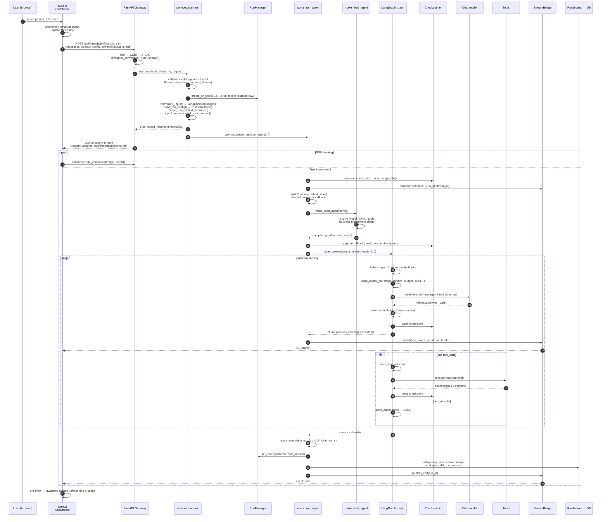
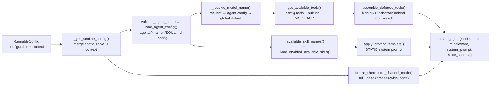

# 02 — Request Lifecycle: One Prompt, End to End

This document follows a single user message — *"Research X and write a report"* typed in
the web UI — through every layer until the answer streams back.

---

## The 14 stages



---

## Stage-by-stage detail

### Stage 1 — Frontend submit

[`frontend/src/core/threads/hooks.ts:1514`](../../frontend/src/core/threads/hooks.ts#L1514)

```ts
await thread.submit(
  { messages: buildThreadSubmitMessages({ text, additionalKwargs, filesForSubmit }) },
  {
    threadId,
    streamSubgraphs: true,
    streamResumable: true,
    config: { recursion_limit: 1000 },
    context: {
      ...context,
      thinking_enabled:  context.mode !== "flash",
      is_plan_mode:      context.mode === "pro" || context.mode === "ultra",
      subagent_enabled:  context.mode === "ultra",
      reasoning_effort:  context.reasoning_effort ?? (ultra:"high" | pro:"medium" | thinking:"low"),
      thread_id: threadId,
    },
  },
);
```

The UI "mode" selector is therefore a **context-flag preset** that reshapes the entire
middleware chain and tool set for the run:

| UI mode | `thinking_enabled` | `is_plan_mode` | `subagent_enabled` | `reasoning_effort` | Effect on the graph |
|---|---|---|---|---|---|
| flash | false | false | false | — | Minimal chain, no todo tool |
| thinking | true | false | false | low | Extended thinking |
| pro | true | **true** | false | medium | `TodoMiddleware` + `write_todos` tool added |
| ultra | true | **true** | **true** | high | + `task` tool + `SubagentLimitMiddleware` |

Files are uploaded first (`POST /uploads`), and their virtual paths ride in
`additional_kwargs.files` on the `HumanMessage`.

---

### Stage 2 — Gateway security boundary

Before the handler runs:
`auth_middleware` → `csrf_middleware` → `@require_permission("runs", "create", owner_check=True, require_existing=True)`.

Inside [`start_run`](../../backend/app/gateway/services.py#L885):

1. **Model allowlist** — `app_config.get_model_config(model_name)`; unknown → HTTP 400.
2. **Thread ownership** — `thread_store.check_access(thread_id, user.id)`; a thread owned
   by another user returns **404, not 403** (anti-enumeration).
3. **Run admission** — `RunManager.create_or_reject(...)` under a `goal_thread_lock`,
   honouring `multitask_strategy` (`reject` | `rollback` | `interrupt` | `enqueue`).
   Conflict → 409; unimplemented strategy → 501.
4. The persisted `RunRecord.kwargs` stores a **secret-redacted** copy of the config
   (`redact_config_secrets`), because the run row is echoed by the API.

---

### Stage 3 — Input normalisation

[`normalize_input`](../../backend/app/gateway/services.py#L153):

```python
converted.extend(convert_to_messages([msg]))   # langchain_core — preserves additional_kwargs, id, name, role
```

Deliberate choices:

- Uses LangChain's own coercion so `additional_kwargs` (uploaded-file metadata),
  `id`, `name`, and non-human roles survive. A hand-rolled earlier version collapsed
  everything into `HumanMessage(content=...)` and silently dropped attachments (gh #3132).
- A malformed message raises **HTTP 400 with the offending index**, not a 500.
- **Server-owned metadata is stripped** from untrusted callers:
  `original_user_content`, dynamic-context reminder markers, the transient view-image
  marker. Only `trusted_internal=True` callers (authenticated IM channel workers) keep them.

---

### Stage 4 — Building the `RunnableConfig`

[`build_run_config`](../../backend/app/gateway/services.py#L441) produces:

```python
{
  "recursion_limit": 100,            # clamped: _clamp_recursion_limit(client_value, max_recursion_limit)
  "configurable": {"thread_id": ...} # checkpointer scope — persisted into checkpoints
  "context":      {...}              # runtime context — NOT persisted
  "metadata":     {...}              # tracing tags
  "run_name":     "...",
  "callbacks":    [...]              # RunJournal + Langfuse/LangSmith handlers
}
```

Hard rules enforced here:

| Rule | Reason |
|---|---|
| `recursion_limit` is **always clamped** (default 100, ceiling `max_recursion_limit`=1000) | An unbounded value lets one run execute unlimited super-steps → runaway LLM cost / DoS |
| Caller keys starting `__` are stripped from `context` | They are the harness's private channels (skill secret binding, active secrets, run journal). A forged `__slash_skill_secret_source` would bypass skill gates (#3938) |
| `is_internal`, `authz_attributes`, `channel_user_id` are **server-owned** | Never accepted from client `config.context`/`configurable` |
| `non_interactive` honoured only for internal callers | It strips `ask_clarification` from the toolset; arbitrary HTTP clients must not force autonomous execution |
| `thread_id` always taken from the **URL path**, never from caller config | The checkpointer scopes by `configurable["thread_id"]` |
| `github_token`, `disable_clarification` → `context` only | `configurable` is persisted in checkpoints; a short-lived token must not land there |
| Both `context` and `configurable` sent → prefer `context`, log a warning | LangGraph ≥0.6 rejects both |

---

### Stage 5 — Launching the background task

```python
task = asyncio.create_task(run_agent(bridge, run_mgr, record, ctx=run_ctx,
                                     agent_factory=make_lead_agent, graph_input=..., config=...,
                                     stream_modes=..., stream_subgraphs=..., interrupt_before=..., interrupt_after=...))
record.task = task
return record          # HTTP responds now; streaming is decoupled
```

Producer (`run_agent`) and consumer (`sse_consumer`) are fully decoupled by the
**StreamBridge**. That is what makes `/runs` (fire-and-forget), `/runs/stream`
(create + stream), `/runs/wait` (create + block), `/runs/{id}/join` and
`/runs/{id}/stream` (attach to an existing run) all work off one code path.

---

### Stage 6 — Worker preamble

[`run_agent`](../../backend/packages/harness/deerflow/runtime/runs/worker.py#L254), in order:

1. `wait_for_prior_finalizing(thread_id, run_id)` — serialise against a run still finalising.
2. `inject_checkpoint_mode(config, mode)` + `aensure_checkpoint_mode_compatible(...)` —
   fail closed if this process's frozen mode cannot read the thread's checkpoints.
3. Create `RunJournal` (a `BaseCallbackHandler`) and append it to `config["callbacks"]`.
4. `set_status(running)`.
5. `capture_workspace_snapshot(thread_id)` — for a post-run file diff.
6. `bridge.publish("metadata", {run_id, thread_id})` — `useStream` needs both.
7. Build `Runtime(context=runtime_ctx, store=store)`, install into `configurable["__pregel_runtime"]`.
8. `inject_langfuse_metadata(...)` — lifts `session_id`/`user_id`/`trace_name`/`tags` onto the root trace.
9. **Build the agent**: `agent = agent_factory(config=initial_runnable_config, app_config=...)`.
10. `accessor = CheckpointStateAccessor.bind(agent, checkpointer, store=store, mode=mode)`.
11. `_capture_rollback_point(...)` — materialized pre-run messages + raw pending writes.
    *Any failure here disables rollback entirely* rather than risking a truncated thread.
12. Attach `agent.checkpointer = checkpointer`, `agent.store = store`,
    `agent.interrupt_before_nodes` / `interrupt_after_nodes`.

---

### Stage 7 — Agent construction

[`make_lead_agent`](../../backend/packages/harness/deerflow/agents/lead_agent/agent.py#L474) →
[`_make_lead_agent`](../../backend/packages/harness/deerflow/agents/lead_agent/agent.py#L501):



Precedence rules resolved here (`_resolve_runtime_option`): **request > per-agent config >
global default**, with `key in cfg` (not `cfg.get(key)`) so an explicit
`thinking_enabled: false` is honoured rather than falling through (issue #4336).

A guard downgrades `thinking_enabled` to `False` with a warning if the resolved model's
profile has `supports_thinking: false`.

---

### Stage 8 — The graph runs

See [01 §9](01-langgraph-usage.md#9-graph-topology-as-actually-executed) for the topology
and [03](03-middleware-stack.md) for what each hook does.

The worker's inner loop:

```python
async def _stream_once(input_payload, stream_config):
    async with _checkpoint_thread_lock(thread_id):          # one writer per thread
        async for item in agent.astream(input_payload, config=stream_config,
                                        stream_mode=lg_modes, subgraphs=stream_subgraphs):
            if record.abort_event.is_set(): break            # cooperative cancellation
            llm_error_fallback_message ||= _extract_llm_error_fallback_message(chunk, pre_existing_message_ids)
            mode, chunk = _unpack_stream_item(item, lg_modes, stream_subgraphs)
            await bridge.publish(run_id, _lg_mode_to_sse_event(mode), serialize(chunk, mode=mode))
            if mode == "custom": await subagent_events.add(chunk)
```

`pre_existing_message_ids` (the set of message ids checkpointed *before* this run) exists so
a stale `deerflow_error_fallback` marker from an earlier turn doesn't mark every subsequent
run on the thread as `error`.

---

### Stage 9 — Hidden goal-continuation turns

After the user-visible turn drains:

```python
while not abort and not llm_error_fallback and not journal.had_llm_error_fallback:
    continuation_input = await _prepare_goal_continuation_input(...)   # goal evaluator LLM
    if continuation_input is None: break
    await _stream_once(continuation_input, _continuation_runnable_config())
```

[`runtime/goal.py`](../../backend/packages/harness/deerflow/runtime/goal.py) implements a
Claude-Code-style goal loop. A thread can carry a persistent `goal` state channel; after
each turn a dedicated evaluator model judges whether the goal is met and classifies the
blocker:

```
GOAL_BLOCKERS = {none, missing_evidence, needs_user_input, run_failed, external_wait, goal_not_met_yet}
CONTINUABLE_GOAL_BLOCKERS = {goal_not_met_yet}
```

Only `goal_not_met_yet` continues. Bounds: `DEFAULT_MAX_GOAL_CONTINUATIONS = 8`,
`DEFAULT_MAX_NO_PROGRESS_CONTINUATIONS = 2`. The evaluation is persisted as a checkpoint
written `as_node="goal_evaluator"` through the synthetic mutation graph.

The continuation config deliberately resets `checkpoint_ns` and drops `checkpoint_id` /
`checkpoint_map`, so the continuation forks from the live head rather than the originally
requested checkpoint.

---

### Stage 10 — Terminal status

| Condition | Status | Extra |
|---|---|---|
| `abort_event` + `abort_action == "rollback"` | `error` | `_rollback_to_pre_run_checkpoint(...)`, error `"Rolled back by user"` |
| `abort_event` otherwise | `interrupted` | — |
| LLM fallback message detected | `error` | message from journal or stream scan |
| normal | `success` | `stop_reason` read from `runtime.context` |

`stop_reason` vocabulary, written by the guard middlewares into `runtime.context`:

| Value | Set by |
|---|---|
| `loop_capped` | `LoopDetectionMiddleware` |
| `token_capped` | `TokenBudgetMiddleware` |
| `safety_capped` | `SafetyFinishReasonMiddleware` |
| `subagent_limit_capped` | `SubagentLimitMiddleware` |

None of these raise. They strip `tool_calls` so LangChain's router ends the loop and the
model produces a real final answer — a capped run still returns useful work.

---

### Stage 11 — `finally` block

1. Flush `_SubagentEventBuffer` (buffered `custom` events → `run_events`).
2. `record_workspace_changes(...)` — diff against the pre-run workspace snapshot.
3. Flush `RunJournal`; persist token usage, LLM call count, per-caller breakdown.
4. Persist run durations (written as a checkpoint entry, hence the
   `_is_duration_only_checkpoint` filter when scanning history).
5. Sync the generated thread title into `threads_meta.display_name`.
6. `bridge.publish_end(run_id)` → `END_SENTINEL` → SSE `event: end`.
7. `bridge.cleanup(run_id, delay=...)` after a grace period for late subscribers.

---

### Stage 12 — SSE consumption

[`sse_consumer`](../../backend/app/gateway/services.py#L1105):

```python
async for entry in bridge.subscribe(record.run_id, last_event_id=request.headers.get("Last-Event-ID")):
    if await request.is_disconnected(): break
    if entry is HEARTBEAT_SENTINEL: yield ": heartbeat\n\n"; continue
    if entry is END_SENTINEL:       yield format_sse("end", None, event_id=entry.id); return
    yield format_sse(entry.event, entry.data, event_id=entry.id)
finally:
    if not record.store_only and record.status in (pending, running) and record.on_disconnect == cancel:
        await run_mgr.cancel(record.run_id)
```

- `Last-Event-ID` gives **resumable streams** (`streamResumable: true` from the frontend).
- Heartbeats every 15 s keep proxies from closing the connection.
- `on_disconnect: "cancel" | "continue"` decides whether closing the tab kills the run.
- `store_only` records are runs owned by *another* gateway worker, hydrated from the run
  store — this worker skips disconnect-cancellation for them because it holds no task handle.

---

### Stage 13 — Non-web entry points

All of these converge on the same `run_agent`:

| Entry | Path |
|---|---|
| IM channels | `app/channels/manager.py::_resolve_run_params` → the same `start_run` contract, with `channel_name` in run context |
| GitHub webhooks | `app/gateway/github/dispatcher.py` → internal auth → `channel_name="github"`; `update_agent` is withheld because the prompt author is an arbitrary external commenter |
| Scheduler | `launch_scheduled_thread_run(...)` → internal caller, `non_interactive=True` strips `ask_clarification` |
| TUI / library | `deerflow.client.DeerFlowClient.stream` → `build_middlewares` directly, its own checkpointer |

---

### Stage 14 — Where the answer physically lives afterwards

| Artefact | Storage |
|---|---|
| The conversation itself | **LangGraph checkpoint** for `thread_id` (`checkpoints` tables / InMemorySaver) |
| Run row (status, tokens, stop_reason, model) | `runs` table |
| Per-event journal (llm.request/response, tool results, middleware events) | `run_events` table (or JSONL / memory) |
| Thread title, owner, status | `threads_meta` table |
| Long-term memory facts | memory backend (`agents/memory/backends/deermem`) |
| Files the agent created | sandbox workspace + `outputs/` on disk; referenced by path in messages |

---

**Next:** [03 — Middleware Stack](03-middleware-stack.md)
