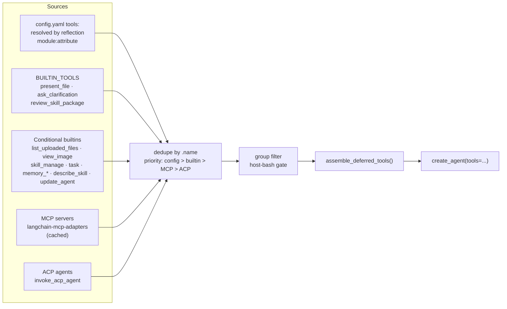
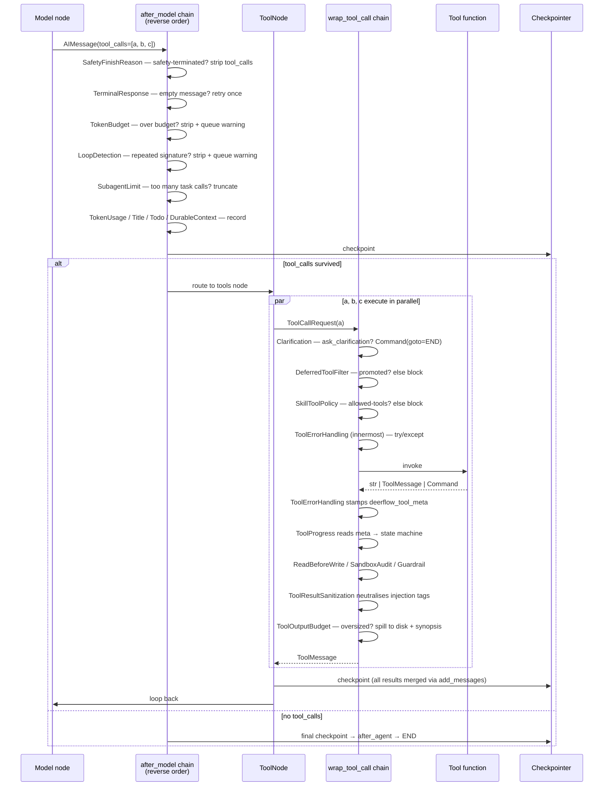
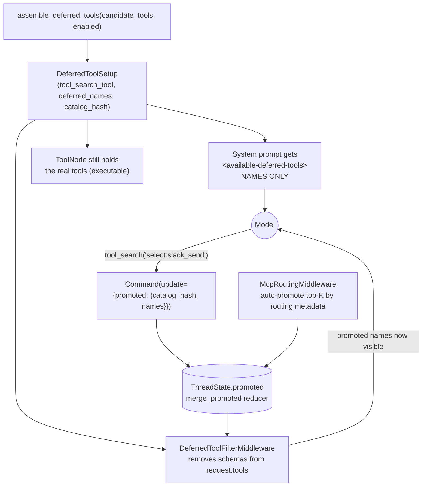

# 05 — Tools, Tool Calling & MCP

---

## 1. Where tools come from

[`tools/tools.py::get_available_tools()`](../../backend/packages/harness/deerflow/tools/tools.py)
is the single assembly point. Five sources, merged and deduplicated by name:



### Configured tools (this deployment's `config.yaml`)

| Group | Tool | Implementation |
|---|---|---|
| `file:read` | `ls`, `read_file`, `glob`, `grep` | `deerflow.sandbox.tools` |
| `file:write` | `write_file`, `str_replace` | `deerflow.sandbox.tools` |
| `bash` | `bash` | `deerflow.sandbox.tools:bash_tool` |
| `web` | `web_search` | `community.ddg_search` |
| `web` | `web_fetch` | `community.jina_ai` |
| `web` | `image_search` | `community.image_search` |
| `diagram` | `render_diagram_mermaid`, `render_diagram_svg` | `community.atlas_diagram` |

Declared `tool_groups`: `web`, `diagram`, `file:read`, `file:write`, `bash`, `browser`.
A custom agent restricts itself by naming a subset in its `tool_groups`, which the `task`
tool then **inherits** into every subagent it spawns.

### The 19 community integrations

`tavily`, `exa`, `serper`, `brave`, `searxng`, `ddg_search`, `jina_ai`, `firecrawl`,
`crawl4ai`, `fastcrw`, `browserless`, `browser_automation`, `image_search`, `infoquest`,
`groundroute`, `atlas_diagram`, `e2b_sandbox`, `aio_sandbox`, `boxlite`
— plus `url_safety.py` and `warm_pool_lifecycle.py` as shared infrastructure.

Swapping a search provider is a one-line `config.yaml` edit (`use:` points at a different
`module:attribute`), resolved by `deerflow.reflection.resolve_variable`.

### Conditional registration

| Tool | Registered when |
|---|---|
| `view_image` | resolved model's profile has `supports_vision: true` |
| `task` | `subagent_enabled` in run context (UI "ultra" mode) |
| `write_todos` | `is_plan_mode` (UI "pro"/"ultra" mode) — comes with `TodoMiddleware` |
| `memory_search`/`add`/`update`/`delete` | `memory.mode == "tool"` |
| `describe_skill` | `skills.deferred_discovery` enabled |
| `skill_manage` | `skill_evolution.enabled` |
| `update_agent` | a custom `agent_name` is active **and** the channel is not a webhook channel |
| `setup_agent` | bootstrap agent only |
| `invoke_acp_agent` | any ACP agents configured |
| `list_uploaded_files` | lead agent only (never subagents) |
| `tool_search` | `tool_search.enabled` **and** MCP tools present |
| `bash` (host) | `is_host_bash_allowed(config)` — stripped when `LocalSandboxProvider` is active without `allow_host_bash` |
| `ask_clarification` | **removed** when `non_interactive` (internal callers only) |

### Deduplication and the name-mismatch warning

```python
if cfg.name != loaded.name:
    logger.warning("Tool name mismatch: config name %r does not match tool .name %r (use: %s). "
                   "The tool's own .name will be used for binding.", ...)
```

Issue #1803: the LLM receives one name in its schema while the runtime router recognises
another → *"not a valid tool"* errors. Duplicate names are dropped with a warning; the
tool's own `.name` always wins for binding.

---

## 2. The tool-calling loop



Note that guard middlewares act at `after_model` — **before** the tools node — so a capped
turn never spends money executing the calls it just stripped.

### The `deerflow_tool_meta` contract

`ToolErrorHandlingMiddleware` (innermost) normalises every tool outcome into a structured
signal stamped on the `ToolMessage`. Defined in
[`tool_result_meta.py`](../../backend/packages/harness/deerflow/agents/middlewares/tool_result_meta.py):

| Field | Consumed by |
|---|---|
| `status` / problem class (`no_results`, `not_found`, `permission`, `transient`, `rate_limited`, `auth`, `config`, `internal`) | `ToolProgressMiddleware` state machine |
| `recoverable_by_model` | Decides `WARNED` (terminal) vs escalation to `BLOCKED` |
| `action` (`stop` / continue) | Immediate `BLOCKED` on `stop` |
| size / truncation info | `ToolOutputBudgetMiddleware` |

This is why the `ToolProgress`-outer-of-`ToolErrorHandling` ordering is asserted at build
time: reverse it and `ToolProgress` reads an unstamped result and silently no-ops.

### Tools that return `Command`

| Tool | Returns | Effect |
|---|---|---|
| `task` | `Command(update={"messages": [...], "delegations": [...]})` | Result + ledger entry atomically |
| `tool_search` | `Command(update={"promoted": {...}})` | Records promotions scoped by `catalog_hash` |
| `ask_clarification` (via middleware) | `Command(update=..., goto=END)` | Ends the turn for human input |

---

## 3. Sandbox tools — virtual paths

[`sandbox/tools.py`](../../backend/packages/harness/deerflow/sandbox/tools.py) is ~1000 lines
of path translation, because the model must never see host paths:

| Virtual path | Maps to |
|---|---|
| `/mnt/user-data/uploads` | thread uploads dir |
| `/mnt/user-data/outputs` | thread outputs dir |
| `/mnt/skills/...` | skills container (with a **disabled-skill filter** — `_is_disabled_skill_path`, `_drop_disabled_skill_paths`) |
| custom mounts | `sandbox.mounts` host→container mapping, honouring `read_only` |
| ACP workspace | per-thread ACP agent workspace |

`replace_virtual_path` translates both directions, preserving path separator style, so
`glob`/`grep`/`ls` results read back as virtual paths.

Per-tool output caps from `config.yaml`:

```yaml
sandbox:
  bash_output_max_chars: 20000        # MIDDLE truncation — errors can be at either end
  read_file_output_max_chars: 50000   # HEAD truncation — content is front-loaded
  ls_output_max_chars: 20000          # HEAD truncation
```

---

## 4. Deferred tools — `tool_search`

**Problem:** a large MCP catalog (100–200 tools) serialised as JSON schemas can consume tens
of thousands of prompt tokens on *every* model call.

**Solution:** withhold the schemas; advertise only names.



Invariants enforced in code:

- `tool_search_tool is None` ⟺ `deferred_names` is empty ⟺ `catalog_hash is None`. The three
  fields move as a unit.
- **Fail closed**: if `tool_search` is enabled and MCP candidates exist but no deferred set
  was recovered, `assemble_deferred_tools` **raises** rather than silently binding full schemas.
- `merge_promoted` scopes by `catalog_hash`: when the catalog changes, stale promotions are
  discarded wholesale — a persisted bare tool name must never resolve to a *different* tool
  after catalog drift.
- `assert_mcp_routing_before_deferred_filter(middlewares)` — routing must promote before the
  filter decides what to hide.

Query grammar for `tool_search`: `select:Read,Edit` (exact), `notebook jupyter` (keyword),
`+slack send` (require + rank).

> In this deployment: `tool_search: {enabled: false, auto_promote_top_k: 3}` — deferral is off,
> so all tool schemas are bound directly.

---

## 5. MCP integration

[`deerflow/mcp/`](../../backend/packages/harness/deerflow/mcp/) — 1702 lines over 6 modules:

| Module | LoC | Role |
|---|---|---|
| `tools.py` | 713 | Converts MCP server tools into LangChain `BaseTool`s via `langchain-mcp-adapters` |
| `session_pool.py` | 460 | Pooled, reusable MCP sessions (connection lifecycle, health) |
| `cache.py` | 227 | Process-wide tool cache with content-based invalidation |
| `oauth.py` | 216 | OAuth flows for MCP servers that require them |
| `client.py` | 68 | `build_server_params` / `build_servers_config` |

### Cache invalidation is content-based, not mtime-based

```python
_config_path: Path | None                  # resolved extensions config path at init
_config_signature: ConfigSignature | None  # (mtime, size, sha256)
```

The comment explains why a strict `mtime >` comparison is not enough: it misses same-second
edits, and mtime can stay put or move *backward* on object-store/network mounts, after
`git checkout`, `cp -p`, or `tar`/`rsync` restores that preserve timestamps. Tracking no
path at all makes switching to a different config file with an equal-or-older mtime
structurally invisible. So the signature is `(mtime, size, sha256)` plus the resolved path.

### Config read freshness

`get_available_tools` deliberately reads `ExtensionsConfig.from_file()` rather than
`config.extensions`:

```python
# NOTE: We use ExtensionsConfig.from_file() instead of config.extensions to always read the
# latest configuration from disk. This ensures that changes made through the Gateway API
# (which runs in a separate process) are immediately reflected when loading MCP tools.
```

### Tagging

Every MCP-sourced tool gets `tag_mcp_tool(t)` so the deferred-tool assembler at each agent
build site can tell MCP tools apart from local ones.

### Failure handling

`ImportError` on `langchain-mcp-adapters` → warning, MCP simply unavailable. Any other
exception → logged error, empty MCP tool list. MCP is never allowed to break agent
construction.

---

## 6. ACP — Agent Client Protocol

`invoke_acp_agent` is built dynamically from `config.acp_agents` and lets DeerFlow call
*other* agent systems as a tool, each with its own per-thread workspace directory
(`_get_acp_workspace_host_path(thread_id)`).

---

## 7. Layered tool authorisation

Six independent gates, each in a different layer:

| # | Gate | Layer | Failure mode |
|---|---|---|---|
| 1 | `tool_groups` filter | build time (`get_available_tools`) | Tool never exists for this agent |
| 2 | Host-bash gate (`is_host_bash_allowed`) | build time | `bash` stripped when `LocalSandboxProvider` is active |
| 3 | Webhook channel gate | build time | `update_agent` withheld on `github` channel |
| 4 | `non_interactive` gate | build time | `ask_clarification` stripped for scheduler/webhook runs |
| 5 | Deferred filter | `wrap_model_call` + `wrap_tool_call` | Schema hidden; call blocked until promoted |
| 6 | Skill `allowed-tools` | `wrap_model_call` + `wrap_tool_call` | Schema filtered; execution blocked |
| 7 | Guardrail / RBAC | `wrap_tool_call` | Policy decision, `fail_closed` configurable |
| 8 | Read-before-write | `wrap_tool_call` | Write to unread file blocked |
| 9 | Sandbox audit | `wrap_tool_call` | Recorded (audit, not block) |

Gates 1–4 are **build-time** (the tool is absent) and 5–9 are **runtime** (the tool exists
but the call is refused). The distinction matters: build-time gates also remove the tool
from the model's schema, so it never even attempts the call.

---

**Next:** [06 — Memory, Chat History & Checkpoints](06-memory-checkpoints-state.md)
