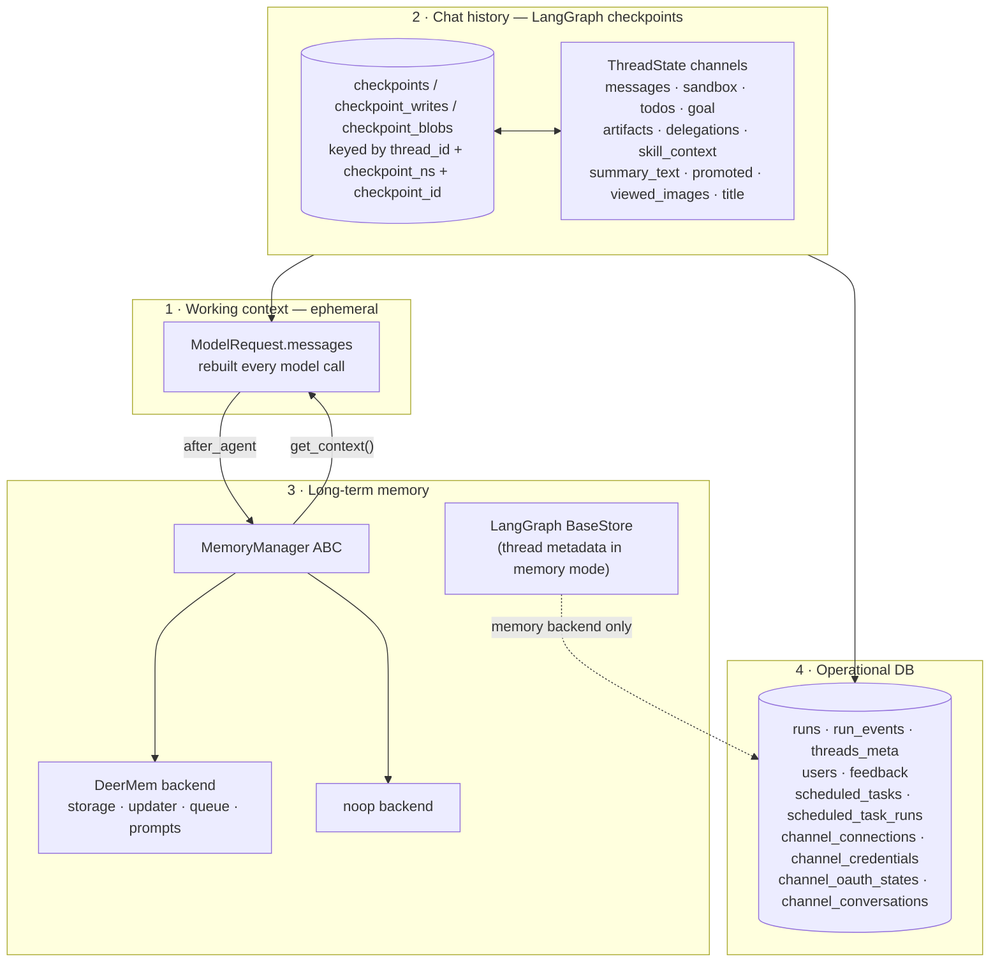
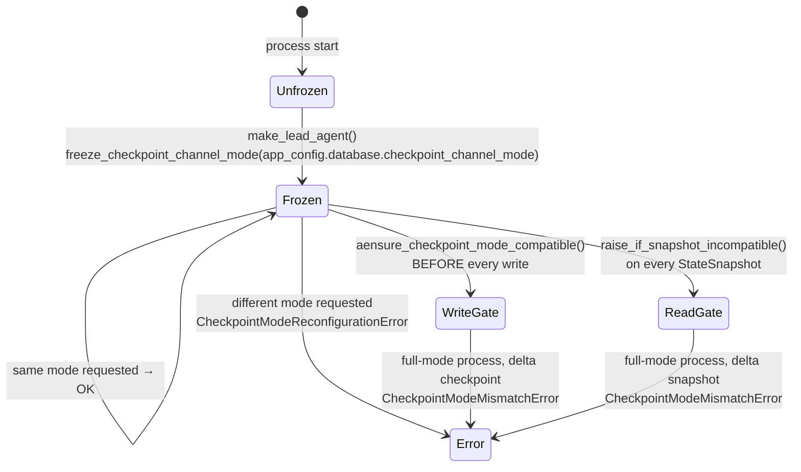
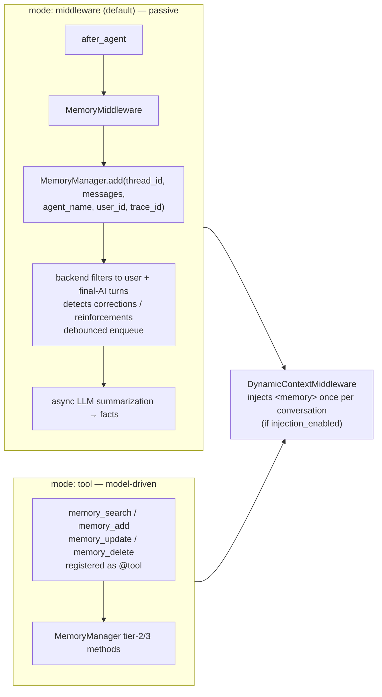
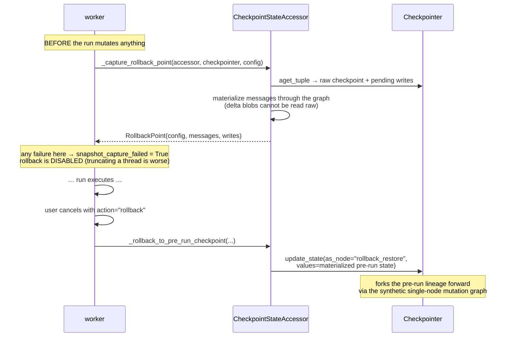

# 06 — Memory, Chat History & Checkpoints

DeerFlow has **four distinct persistence layers** that are easy to confuse. Getting them
straight is the point of this document.

| Layer | Scope | Storage | Lifetime | Who reads it |
|---|---|---|---|---|
| **1. Working context** | one model call | none (recomputed) | milliseconds | the model |
| **2. Thread state / chat history** | one thread | **LangGraph checkpointer** | forever | the graph, the API, the UI |
| **3. Long-term memory** | one user (optionally per-agent) | pluggable `MemoryManager` backend | forever, across threads | `DynamicContextMiddleware`, memory tools |
| **4. Operational records** | runs, events, users, threads metadata | SQLAlchemy tables | forever | the API, analytics, audit |



---

## 2. Chat history *is* the checkpoint

DeerFlow has **no messages table**. The conversation is the `messages` channel of the
LangGraph checkpoint for that `thread_id`. Everything the API exposes as "history" is a
checkpoint read:

| Endpoint | Implementation |
|---|---|
| `GET /threads/{id}/messages` | `CheckpointStateAccessor.aget(config)` → `snapshot.values["messages"]` |
| `GET /threads/{id}/messages/page` | scans checkpoint history in batches of 201 |
| `GET /threads/{id}/runs/{rid}/messages` | filters the run journal by `run_id` |
| `POST /runs/wait` | `serialize_channel_values_for_api(snapshot.values)` |
| `POST /runs/regenerate/prepare` | walks checkpoint history to find a fork point |

### `CheckpointStateAccessor` — the single choke point

[`runtime/checkpoint_state.py`](../../backend/packages/harness/deerflow/runtime/checkpoint_state.py)

```python
accessor = CheckpointStateAccessor.bind(agent, checkpointer, store=store, mode=mode)
```

It binds three things together: a **compiled graph** (carrying the mode-matched channel
schema), a **checkpointer**, and the **frozen channel mode**. Every read injects the mode
marker and passes the compatibility gate before touching state.

Why it must exist: **delta checkpoints store no full `channel_values`.** A raw
`checkpointer.aget_tuple(config)` on a delta thread returns *sentinels*, not messages.
Reading state without going through the accessor silently yields empty history.

---

## 3. Checkpoint backends

Resolved from one `database:` section ([`config/database_config.py`](../../backend/packages/harness/deerflow/config/database_config.py)):

| `backend` | Checkpointer | Store | App persistence | Notes |
|---|---|---|---|---|
| `memory` *(default)* | `InMemorySaver` | `InMemoryStore` | in-memory repos | Nothing survives restart |
| `sqlite` | `AsyncSqliteSaver` | SQLite store | same file | `{sqlite_dir}/deerflow.db`, **WAL journal mode** on every connection; readers don't block the single writer; 5 s busy timeout |
| `postgres` | `AsyncPostgresSaver` | Postgres store | same URL | **Independent connection pools** with different lifecycles |

Both a **sync** provider (singleton + `contextmanager`, for CLI/TUI/`DeerFlowClient`) and an
**async** provider (used by the gateway's `AsyncExitStack`) exist for each.

A legacy `checkpointer:` config section, when present, **takes precedence** over `database:`
— deliberately, so Checkpointer and Store never diverge onto different backends.

**Multi-worker gate:** `_enforce_postgres_for_multi_worker(startup_config)` rejects SQLite
when `GATEWAY_WORKERS > 1`. SQLite write locks cannot support concurrent multi-process access.

---

## 4. Full vs delta channel mode

This is DeerFlow's most intricate persistence mechanism.

### The problem

In `full` mode every checkpoint stores the entire message list. A 200-turn thread with large
tool outputs writes the whole history on **every super-step** — quadratic storage growth.

### The mechanism

```python
DELTA_MESSAGES_FIELD = Annotated[
    list[AnyMessage],
    DeltaChannel(merge_message_writes, snapshot_frequency=1000),
]
class DeltaThreadState(ThreadState):
    messages: DELTA_MESSAGES_FIELD
```

LangGraph's `DeltaChannel` stores per-step *writes* plus a full snapshot every 1000 steps;
reads replay the walk from the nearest snapshot.

### The safety protocol

Because a full-mode process reading a delta thread would materialise **empty state**, the
mode is guarded at four points:



1. **Freeze** — first `make_lead_agent` call in the process freezes the mode. The app config
   owns it; a client-supplied `configurable` key is ignored on the first freeze, so a direct
   LangGraph request cannot reconfigure (or crash) a fresh process. Once frozen, an
   *internally injected* key or the app config must **match**.
2. **Mark** — `inject_checkpoint_mode` stamps
   `metadata["deerflow_checkpoint_channel_mode"] = "delta"` on every delta write.
3. **Write gate** — `aensure_checkpoint_mode_compatible` before any write. *A write cannot be
   un-applied*, so this checks ahead of time.
4. **Read gate** — `raise_if_snapshot_incompatible` on the returned `StateSnapshot`. Reads use
   the snapshot's own metadata (no extra fetch). Reading the blob is harmless; silently *using*
   the empty state is the danger, and the caller never receives it.

**Migration direction:** `full → delta` is supported (delta processes read legacy full
checkpoints transparently). `delta → full` requires materialising and converting first.
The mode is **restart-required**, and all processes sharing one checkpoint database must agree.

### Detecting delta without a marker

```python
def checkpoint_metadata_uses_delta(metadata) -> bool:
    if metadata.get("deerflow_checkpoint_channel_mode") == "delta": return True
    counters = metadata.get("counters_since_delta_snapshot")
    return isinstance(counters, dict) and "messages" in counters
```

The second branch reads LangGraph's own internal delta bookkeeping — a belt-and-braces check
for checkpoints written before DeerFlow's marker existed.

### The upstream bug patch

[`checkpoint_patches.py`](../../backend/packages/harness/deerflow/checkpoint_patches.py) —
`ensure_inmemory_delta_history_patch()`:

> `InMemorySaver.get_delta_channel_history` overrides the base walk with a single-pass version
> that, upon reaching the first checkpoint carrying a non-empty plain-value blob for a channel,
> skips that checkpoint's *own* pending writes as "subsumed" by the blob. That is only true when
> the blob was written by that same checkpoint. When the version was carried forward from an
> older ancestor — exactly the first super-step after a full→delta migration — those pending
> writes postdate the blob and are silently dropped: **the first message appended after migration
> vanishes from materialized state.**

The patch delegates `InMemorySaver` to `BaseCheckpointSaver`'s (correct) implementation. It is:

- **Idempotent** (`_deerflow_delta_history_patched` flag),
- **Version-gated** — validated against langgraph **1.2.9**; warns if LangGraph moves past it so
  the patch is re-inspected rather than silently overriding an upstream fix,
- **Self-standing-down** — no-ops if the upstream override disappears,
- Imported from `agents/thread_state.py` (not `runtime/`) so every process that builds a
  DeerFlow graph — gateway, workers, in-process LangGraph runtime, tests — gets it, without
  pulling in the heavy `runtime` package `__init__`.

---

## 5. Long-term memory

[`agents/memory/`](../../backend/packages/harness/deerflow/agents/memory/) — a pluggable
backend architecture.

### The contract

`MemoryManager` is a **pydantic `BaseModel`**, not a bare ABC — so the contract gains field
validation and serialisation for free and shares the pydantic v2 type system with backend
configs. Pydantic's `ModelMetaclass` derives from `ABCMeta`, so unimplemented
`@abstractmethod`s still raise `TypeError` **at instantiation**. Backend-private dependencies
(storage, llm, queue) are `PrivateAttr` set in `model_post_init`, kept out of the schema.

Three tiers of methods:

| Tier | Methods | Required? |
|---|---|---|
| 1 — core | `add`, `get_context` (+ `aadd`, `aget_context`) | **Yes** — abstract |
| 2 — query | `search`, `get_memory`, `reload_memory`, `export_memory`, `import_memory`, `clear_memory`, `delete_memory` | Expected |
| 3 — mutation hooks | `create_fact`, `update_fact`, `delete_fact` | Default `raise NotImplementedError`; the memory tools catch it and return a JSON `error` |
| lifecycle | `shutdown_flush(timeout)`, `warm()`, `on_pre_compress`, `on_turn_start` | Optional |

**Swapping backends** = drop a `backends/<name>/` folder exposing `MANAGER_CLASS` and set
`manager_class: <name>`. Nothing else in DeerFlow changes.

### Shipped backends

| Backend | LoC | What it is |
|---|---|---|
| `deermem` | ~5500 (`storage.py` 1477, `updater.py` 1615, `prompt.py` 786, `queue.py` 374, `message_processing.py` 248) | The real implementation: LLM fact extraction, confidence thresholds, category budgets, staleness review, consolidation, debounced queue |
| `noop` | — | Inherits the tier-3 `NotImplementedError`s; memory tools return errors |

Config separation is deliberate: [`config/memory_config.py`](../../backend/packages/harness/deerflow/config/memory_config.py)
holds **only** the host-shared fields (`enabled`, `mode`, `injection_enabled`,
`shutdown_flush_timeout_seconds`, `manager_class`, `backend_config`). DeerMem's own ~24 knobs
live in `backends/deermem/deermem/config.py` and are reached via `backend_config`. Legacy
top-level DeerMem fields are **auto-migrated** into `backend_config` on load, so an upgrade
doesn't silently revert customised settings to defaults.

### Two mutually exclusive modes



In `tool` mode `MemoryMiddleware` is **not** registered and the four memory tools are appended
instead — the model gains agency over what to remember, when to search, and when to retire a
stale fact.

### The ContextVar trap

```python
# Capture user_id at enqueue time while the request context is still alive.
# threading.Timer fires on a different thread where ContextVar values are not
# propagated, so we must store user_id explicitly in ConversationContext.
user_id = get_effective_user_id()
```

The debounce timer runs on another thread. Reading `user_id` lazily there would resolve to
`None` — and facts would be written to the wrong (or no) user.

### Shutdown drain

The gateway's lifespan drains the memory queue before the worker exits (best-effort, bounded
by `shutdown_flush_timeout_seconds`), after IM channels and the scheduler are stopped so no
new updates arrive during the drain.

---

## 6. The `BaseStore`

`Runtime(context=..., store=store)` makes a LangGraph `BaseStore` available to tools and
middleware. In this codebase it is used mainly by `MemoryThreadMetaStore` — the
**memory-backend** implementation of thread metadata (`aput`/`asearch` on a `THREADS_NS`
namespace) used when `database.backend == "memory"`. With SQLite/Postgres, thread metadata
goes to the `threads_meta` table via SQLAlchemy instead.

`make_thread_store(session_factory, store)` picks between them.

---

## 7. Operational tables

| Table | Module | Contents |
|---|---|---|
| `runs` | `persistence/run/model.py` | run_id, thread_id, assistant_id, status, kwargs (**secret-redacted**), token totals, `stop_reason`, lease fields |
| `run_events` | `persistence/models/run_event.py` | the `RunJournal` stream: `run.start`, `run.end`, `run.error`, `llm.human.input`, `llm.ai.response`, `llm.tool.result`, `llm.error`, `middleware:{tag}`, `context:memory` |
| `threads_meta` | `persistence/thread_meta/model.py` | thread_id, user_id, display_name, status, metadata |
| `users` | `persistence/user/model.py` | local auth + OIDC identities |
| `feedback` | `persistence/feedback/model.py` | thumbs / LangSmith feedback keys |
| `scheduled_tasks`, `scheduled_task_runs` | `persistence/scheduled_*` | cron definitions and their executions |
| `channel_connections`, `channel_credentials`, `channel_oauth_states`, `channel_conversations` | `persistence/channel_connections/model.py` | IM channel bindings |

`RunEventStore` itself is pluggable: `db` (SQLAlchemy), `jsonl` (file), or `memory`.

---

## 8. Time travel: rollback, regenerate, branch, compact

All four are checkpoint-lineage operations.

### Rollback (cancel with `abort_action="rollback"`)



Why materialized messages are captured up front: delta checkpoints omit `channel_values`, so
the raw blob cannot reconstruct the message list. Rollback must fork the pre-run lineage
*through the graph*.

### Regenerate

[`_prepare_regenerate_payload`](../../backend/app/gateway/routers/thread_runs.py#L424):

1. Read the latest checkpoint; locate the target `AIMessage`.
2. Reject unless it is a **visible** AI message **and** the latest one.
3. Walk backwards to its preceding visible `HumanMessage`.
4. `_find_base_checkpoint_before_human(...)` — scan checkpoint history (raw limit **400**,
   effective **200**) for the last addressable checkpoint *before* that human message.
5. `_find_target_run_id(...)` — resolve the source run from `run_events`, falling back to
   recent successful runs whose last AI message matches.
6. Return `{input: {messages: [cleaned human message]}, checkpoint, metadata}`. The client
   POSTs that back as a new run → LangGraph forks at that checkpoint.

The **raw scan limit is doubled** (`REGENERATE_HISTORY_RAW_SCAN_LIMIT = 200 * 2`) because
duration-only checkpoints — one per successful run in steady state — consume roughly half of
history. `_is_duration_only_checkpoint` filters them out.

### Branch

`branchThreadFromTurn` (frontend) + `apply_checkpoint_to_run_config` (backend): start a run
from an arbitrary historical `checkpoint_id`. LangGraph's native lineage handles the fork.

### Manual compaction

[`runtime/context_compaction.py`](../../backend/packages/harness/deerflow/runtime/context_compaction.py)
calls the summarization middleware's `acompact_state` and writes the compacted state as a
checkpoint `as_node="manual_compaction"` through the mutation graph.

> **The schema trap:** `build_state_mutation_graph` must be compiled with the thread's
> *effective* schema (the class the assistant graph was compiled with), not the base
> `ThreadState`. The base fallback does not know channels contributed by custom middleware,
> **and writes to unknown channels are silently discarded.**

---

## 9. Concurrency control

| Mechanism | Scope | Purpose |
|---|---|---|
| `_checkpoint_thread_lock(thread_id)` | in-process | One `astream` writer per thread at a time |
| `goal_thread_lock(thread_id)` | in-process | Serialise run creation + goal state mutation |
| `RunManager.create_or_reject(multitask_strategy=...)` | per thread | `reject` (409) / `rollback` / `interrupt` / `enqueue` |
| Run leases + `start_heartbeat()` | cross-worker | A run is owned by one worker; expired leases are reclaimed at startup by `reconcile_orphaned_inflight_runs` |
| `wait_for_prior_finalizing(thread_id, run_id)` | per thread | Don't start while a prior run is still writing its terminal state |
| `Retry-After` on 409 cancel | HTTP | Computed from the live lease expiry + grace |
| SQLite WAL + 5 s busy timeout | storage | Concurrent readers, single writer |

---

**Next:** [07 — Subagents & Delegation](07-subagents-delegation.md)
