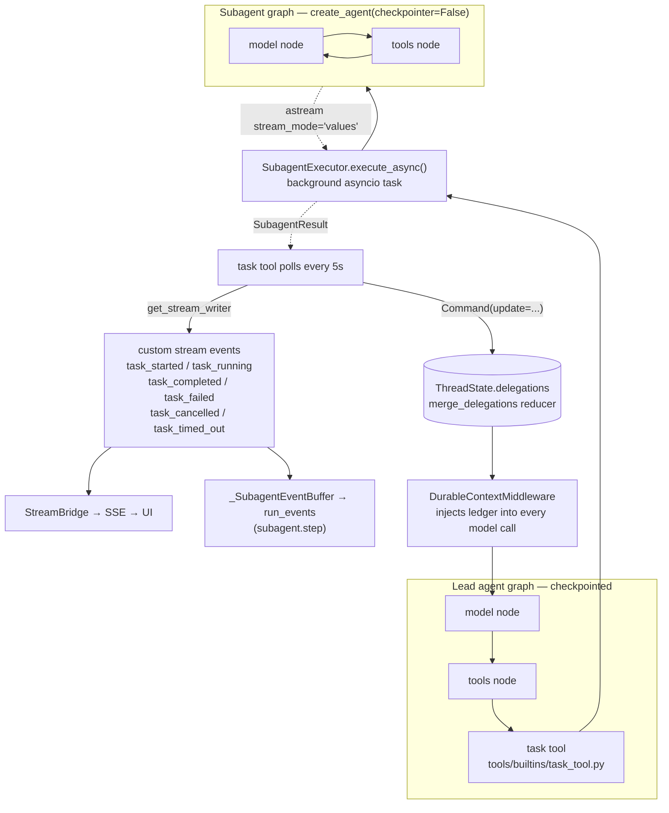
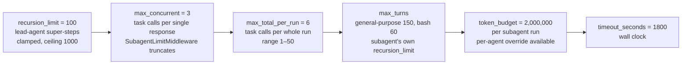
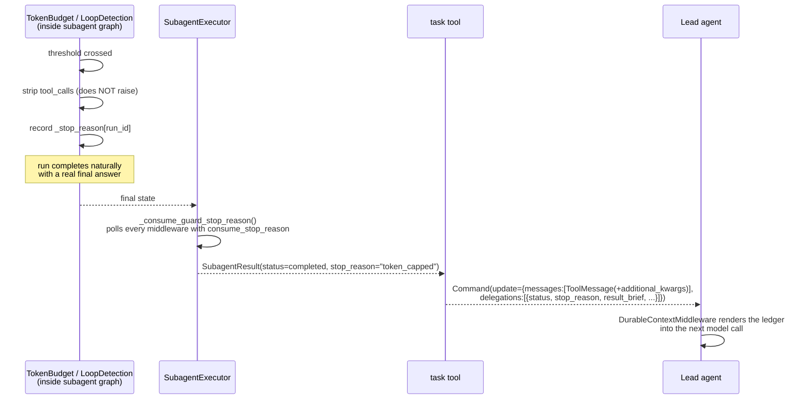

# 07 — Subagents & Delegation

> Enabled only when the run context carries `subagent_enabled: true` — the UI's **"ultra"**
> mode. Off by default.

---

## 1. Shape of the system

A subagent is **its own `create_agent` graph**, running *inside a single tool call* of the
lead agent's tools node.



**Key structural facts:**

- One `task()` dispatch = **one lead-agent super-step**. The subagent's entire multi-turn run
  happens inside that step. So the lead's `recursion_limit` (100) and the subagent's
  `max_turns` are independent budgets — the code comments warn explicitly against conflating them.
- Subagents run with **`checkpointer=False`** — ephemeral, no persistence. Their only durable
  trace is the result summary in the delegation ledger plus `subagent.step` run events.
- Subagents run with **`state_schema=ThreadState`** (never `DeltaThreadState`) — they have no
  checkpoint to be delta-encoded.
- Subagents **cannot call `task`** — `disallowed_tools` defaults to `["task"]`, the registry
  strips it, `get_available_tools(subagent_enabled=False)` never adds it, and the built-in
  system prompt says *"You must NEVER attempt to call `task`."* No recursive nesting.

---

## 2. The `task` tool

```python
@tool("task", parse_docstring=True)
async def task_tool(
    runtime: Runtime,
    description: str,
    prompt: str,
    subagent_type: str,
    tool_call_id: Annotated[str, InjectedToolCallId],
) -> str | Command:
```

`InjectedToolCallId` is used as the **`task_id`**, giving end-to-end traceability from the
model's tool call through the background task to the ledger entry and the UI card.

### What it propagates from the parent

| Category | Keys |
|---|---|
| Execution | `sandbox` state, `thread_data`, `thread_id`, `run_id`, parent `model_name` |
| Identity / authz | `user_id`, `user_role`, `oauth_provider`, `oauth_id`, `is_internal`, `authz_attributes`, `channel_user_id` |
| Tracing | `trace_id`, `deerflow_trace_id` |
| Policy | parent `tool_groups`, merged skill allowlist (`_merge_skill_allowlists`) |

The authz propagation is load-bearing:

> *"Propagate the authenticated runtime context so delegated tool calls are evaluated by
> GuardrailMiddleware with the same identity/attribution as the lead agent... Without this,
> role-aware policy silently mis-attributes any tool call delegated to a subagent
> (`user_role=None`)."*

And for group chats:

> *"IM-channel sender identity: group chats share one thread across senders, so delegated bash
> commands need the dispatching turn's `channel_user_id`."*

### Polling

The **backend** polls, not the model:

```python
max_poll_count = (config.timeout_seconds + 60) // 5   # every 5s, timeout + 60s buffer
```

This was a deliberate change — `task_status_tool` still exists but is no longer exposed to
the LLM. Each newly-observed subagent `AIMessage` emits a `task_running` custom event with a
1-based `message_index`, so the UI accumulates a full step timeline instead of overwriting
(#3779).

### Return value

A `Command` that writes the `ToolMessage` **and** the ledger entry atomically:

```python
return _task_result_command(
    tool_call_id=tool_call_id,
    status="completed" | "failed" | "cancelled" | "timed_out",
    result=..., error=..., stop_reason=..., model_name=..., usage=...,
)
```

---

## 3. `SubagentExecutor`

[`subagents/executor.py`](../../backend/packages/harness/deerflow/subagents/executor.py) — 1167 lines.

```python
return create_agent(
    model=create_chat_model(name=self.model_name, thinking_enabled=False,
                            app_config=app_config, attach_tracing=False),
    tools=tools,
    middleware=build_subagent_runtime_middlewares(...),
    system_prompt=None,          # folded into initial state messages instead
    state_schema=ThreadState,
    checkpointer=False,
)
```

`system_prompt=None` is intentional: the prompt is placed into the **initial state messages**
so the request carries a single `SystemMessage` — "which some LLM APIs don't support" in
multiples.

`thinking_enabled=False` — subagents never use extended thinking.

### Run config

```python
run_config: RunnableConfig = {
    "recursion_limit": self.config.max_turns,     # THIS is the subagent's turn budget
    "callbacks": [SubagentTokenCollector(caller=f"subagent:{name}"), *tracing_callbacks],
    "tags": [f"subagent:{name}"],
}
```

> *"Do not put checkpoint coordinates (`thread_id`/`checkpoint_ns`/etc.) in the child config.
> LangGraph inherits those coordinates from the ambient parent run so this execution keeps its
> subgraph namespace."*

Business `thread_id` is passed via `context` instead, which is why `streamSubgraphs: true`
from the frontend surfaces subagent frames.

### Execution

```python
async for chunk in agent.astream(state, config=run_config, context=context, stream_mode="values"):
    if result.cancel_event.is_set(): ...   # cooperative cancellation
```

> Cancellation is only detected **at astream iteration boundaries**, so a long-running tool
> call within one iteration is not interrupted until the next chunk.

On `GraphRecursionError` (i.e. `max_turns` reached) the executor **recovers the partial
result** rather than discarding the work, and marks it `turn_capped`.

---

## 4. Built-in and custom subagents

| Name | `max_turns` | Purpose |
|---|---|---|
| `general-purpose` | **150** | Complex multi-step tasks needing exploration + action and isolated context |
| `bash` | **60** | Shell-focused work |
| *custom* | configurable | From `subagents.custom_agents` in `config.yaml` |

`SubagentConfig` fields: `name`, `description`, `system_prompt`, `tools`, `disallowed_tools`
(default `["task"]`), `skills`, `model` (`"inherit"`), `max_turns`, `timeout_seconds`.

**Model resolution** (`resolve_subagent_model_name`): explicit `config.model` → parent's model
(when `"inherit"`) → first configured model.

**Timeout layering:** the dataclass default `timeout_seconds=900` is a bare fallback; the
registry layers the global `subagents.timeout_seconds` (default **1800**) over built-ins, so
900 only applies when no differing global value exists.

The registry also strips the `bash` subagent when `is_host_bash_allowed(config)` is false
(`LOCAL_BASH_SUBAGENT_DISABLED_MESSAGE`).

---

## 5. The three-level budget



From `config.yaml`:

> *"Total number of subagent delegations allowed in one lead-agent run. This is a deterministic
> backstop against repeated planning checkpoints launching legal-sized batches forever. The
> default 6 allows two full batches at the default concurrency of 3."*

The prompt reinforces the numbers in three places — `{subagent_section}`,
`{subagent_reminder}`, and `{subagent_thinking}` — with a "DECOMPOSITION CHECK: count your
sub-tasks; if count > N you MUST plan batches of ≤N and only launch the FIRST batch now."

**Why the budgets exist at all (issue #3875):** a degenerate subagent could previously loop
unchecked until `max_turns`, re-sending a growing context each turn. The reported incident was
a **4.4 M-token burn**. Phase 1 added `LoopDetectionMiddleware` to the subagent chain; Phase 2
added `TokenBudgetMiddleware`; Phase 3 tuned the default ceiling.

---

## 6. The status contract

[`subagents/status_contract.py`](../../backend/packages/harness/deerflow/subagents/status_contract.py)
— an explicitly versioned wire contract between backend, ledger and frontend.

```python
SUBAGENT_STATUS_VALUES = ("completed", "failed", "cancelled", "timed_out", "polling_timed_out")
SubagentStopReasonValue = Literal["token_capped", "turn_capped", "loop_capped"]
```

Keys carried in `ToolMessage.additional_kwargs`:

| Key | Meaning |
|---|---|
| `subagent_status` | terminal status |
| `subagent_stop_reason` | *additive*: which guardrail cap fired |
| `subagent_error` | human-readable error blob |
| `subagent_result_brief` | ≤2000-char summary |
| `subagent_result_sha256` | 64 lowercase hex chars — readers enforce the shape so a corrupted relay value cannot masquerade as a digest |
| `subagent_model_name`, `subagent_token_usage` | attribution |

The crucial semantic:

> A capped run that **still produced a final answer** stays `status=completed` and carries the
> cap in `stop_reason`. A capped run with **no usable output** is `status=failed` + `stop_reason`.
> Old frontends ignore the unknown field.

That is what lets the lead agent distinguish *"out of budget but here's what I got"* from
*"broken subagent"* without parsing result text.

---

## 7. How guard caps surface



`_stop_reason_middlewares` is collected **duck-typed** (`hasattr(m, "consume_stop_reason")`),
so the executor needs no imports of the middleware classes, and a *list* rather than
`next(...)` so a newly added guard is picked up automatically.

The `_stop_reason` dict is deliberately **not** cleared by `after_agent`/`_clear_run_state`,
so the executor can read it after the run returns. A `BoundedDict` prevents unbounded growth
on abandoned runs, and each `task` run builds a fresh middleware instance so parallel
subagents sharing `thread_id`/`run_id` cannot cross-contaminate.

---

## 8. The delegation ledger

Channel: `ThreadState.delegations: Annotated[list[DelegationEntry], merge_delegations]`

```python
class DelegationEntry(TypedDict):
    id: str
    run_id: NotRequired[str]
    description: str
    subagent_type: str
    status: str
    result_brief: NotRequired[str]
    result_sha256: NotRequired[str]
    result_ref: NotRequired[str]
    stop_reason: NotRequired[str]
    created_at: str
```

`merge_delegations` guarantees: upsert by `id`, **terminal status is never overwritten by a
non-terminal status**, `created_at`/`run_id` are preserved from the earlier entry, and the list
is capped at **50** entries (oldest dropped).

`DurableContextMiddleware` renders this ledger into every model call. That is the mechanism by
which the lead agent remembers *"subagent-3 completed the market analysis, brief: …, result at
`/outputs/market.md`"* **even after summarization has compacted the raw tool messages away.**

---

## 9. Token accounting across the boundary

```mermaid
flowchart LR
    SC["SubagentTokenCollector<br/>(a LangChain callback on the subagent's run_config)"] --> REC["token_usage_records"]
    REC --> SUM["_summarize_usage()"]
    SUM --> CACHE["_subagent_usage_cache[tool_call_id]"]
    CACHE --> TUM["TokenUsageMiddleware<br/>pop_cached_subagent_usage(tool_call_id)"]
    TUM --> AIM["writes usage back onto the<br/>triggering AIMessage.usage_metadata"]
    AIM --> TBM["TokenBudgetMiddleware sums AIMessage<br/>usage_metadata across history"]
    TBM --> LEADCAP["lead-agent token budget now<br/>INCLUDES delegated work"]
```



This retroactive write-back is why the lead agent's budget can't be circumvented by delegating.
The gateway exposes the same breakdown at `GET /threads/{id}/token-usage`:
`by_model`, and `by_caller` = `{lead_agent, subagent, middleware}`.

---

**Next:** [08 — Sandbox & Execution Safety](08-sandbox-and-safety.md)
