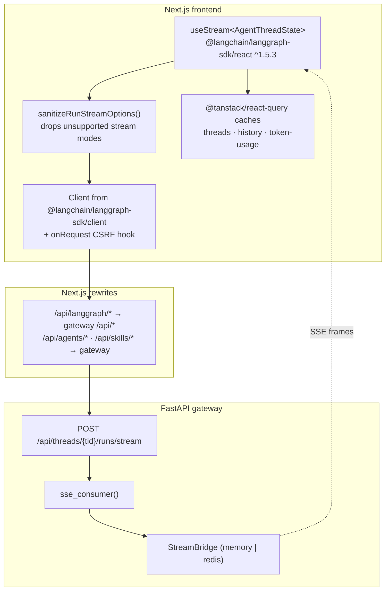
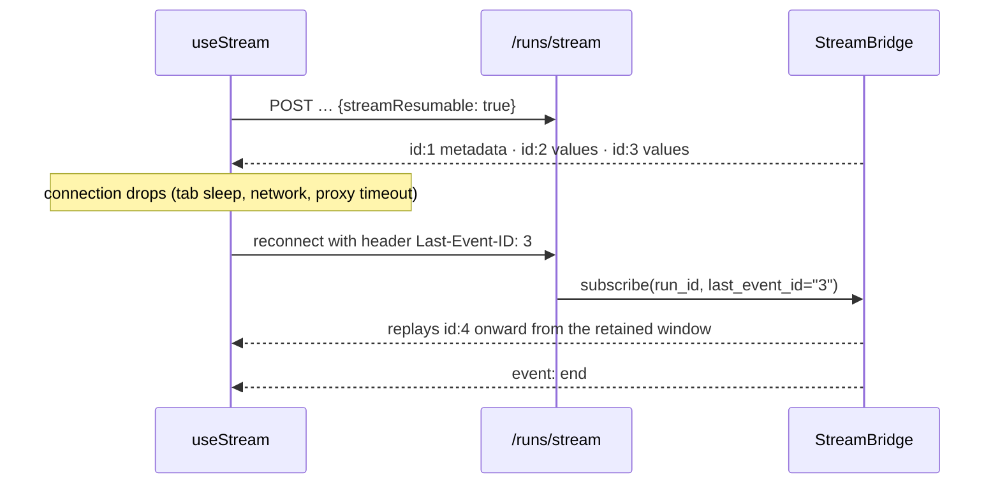
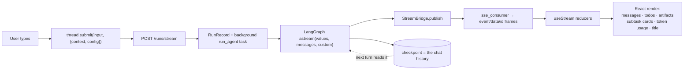

# 09 — Frontend & the SSE Contract

> The design goal, stated in the router docstring: *"SSE format is aligned with the LangGraph
> Platform protocol so that the `useStream` React hook from `@langchain/langgraph-sdk/react`
> works without modification."*

DeerFlow's gateway is a **protocol-compatible reimplementation** of LangGraph Platform, not a
bespoke API. That single decision buys the entire frontend streaming layer for free.

---

## 1. The stack



---

## 2. The wire format

[`format_sse`](../../backend/app/gateway/services.py#L85):

```
event: values
data: {"messages":[...],"todos":[...],"artifacts":[...]}
id: 42

```

Field order is **`event:` → `data:` → `id:` → blank line** — matching the LangGraph Platform
wire format consumed by `useStream` and by the Python `langgraph-sdk` SSE decoder.

### Event names

| SSE `event` | Source | Payload |
|---|---|---|
| `metadata` | worker, first frame | `{run_id, thread_id}` — `useStream` needs **both** |
| `values` | LangGraph `values` mode | Full serialized state snapshot per super-step |
| `messages` / `messages-tuple` | LangGraph `messages` mode | Token-level message chunks |
| `updates` | LangGraph `updates` mode | Per-node state deltas |
| `custom` | `get_stream_writer()` | `task_started` / `task_running` / `task_completed` / `task_failed` / `task_cancelled` / `task_timed_out` / `llm_retry` |
| `debug` | LangGraph `debug` mode | — |
| `error` | worker exception handler | `{message, name}` |
| `end` | `END_SENTINEL` | `null` — terminal frame |
| *(comment)* | heartbeat | `: heartbeat\n\n` every 15 s |

`events` mode is accepted by the API but **skipped** with a log line — it would require
`astream_events` plus checkpoint callbacks, which the worker does not implement.

### Protocol details that make the SDK work unmodified

| Detail | Why |
|---|---|
| `Content-Location: /api/threads/{tid}/runs/{rid}` | *"The SDK uses a greedy regex to extract the run id from this path, so it must point at the canonical run resource without extra suffixes."* |
| `Cache-Control: no-cache`, `Connection: keep-alive`, `X-Accel-Buffering: no` | Prevents nginx/proxy buffering of the stream |
| Monotonic `id:` on every frame | Enables `Last-Event-ID` resumption |
| `event: end` with `data: null` | Terminates the SDK's stream loop cleanly |

---

## 3. Resumption and reconnection



Frontend side: `useStream({ reconnectOnMount: true, fetchStateHistory: { limit: 1 } })`.

Bridge side:

- **`MemoryStreamBridge`** — a per-run in-process event log (`_RunStream`) retaining events for
  a bounded window so late subscribers and reconnects can replay from `Last-Event-ID`.
  Single-process only.
- **`RedisStreamBridge`** — Redis Streams, `supports_cross_process = True`. Required for
  multi-worker deployments so any worker can serve the SSE connection for a run executing on
  another. The import raises a precise, actionable `ImportError` when the `redis` extra is
  missing rather than a bare `ModuleNotFoundError`.

### The terminal-run edge case

`_terminal_record_stream_missing(bridge, record)` probes `bridge.stream_exists(run_id)` when a
run is already terminal. This exists because of a real hang:

> *"Reconnecting (`joinStream`) to such a run either 409s or, once the backend's in-memory
> stream bridge is reaped (`worker.py` calls `publish_end` unconditionally, including for
> interrupted runs, then reaps the bridge after 60s), blocks forever on a drained condition
> variable."*

So a terminal run with no retained stream immediately yields `event: end` instead of blocking.

### Disconnect semantics

`on_disconnect: "cancel" | "continue"` (default `cancel`). The `finally` block of
`sse_consumer` cancels the background run when the client goes away — **unless** the record is
`store_only` (a run owned by another worker, hydrated from the run store), because this worker
holds no task handle and `run_mgr.cancel()` would 409.

---

## 4. The `useStream` configuration

[`frontend/src/core/threads/hooks.ts:1042`](../../frontend/src/core/threads/hooks.ts#L1042):

```ts
const thread = useStream<AgentThreadState>({
  client: getAPIClient(isMock),
  assistantId: "lead_agent",
  threadId: onStreamThreadId,
  reconnectOnMount: true,
  fetchStateHistory: { limit: 1 },
  onCreated(meta) { /* seed react-query caches optimistically */ },
  onLangChainEvent(event) { if (event.event === "on_tool_end") … },
  onUpdateEvent(data) { /* title updates, summarization transient messages */ },
  onCustomEvent(event) { /* task_* → subtask store; llm_retry → toast */ },
  onError(error) { /* clear optimistic state, invalidate caches, toast */ },
  onFinish(state) { /* invalidate history + token-usage caches */ },
});
```

`assistantId: "lead_agent"` — as [`resolve_agent_factory`](../../backend/app/gateway/services.py#L392)
explains, **every** `assistant_id` maps to `make_lead_agent`. Custom agents are
`lead_agent` + an `agent_name` injected into `configurable` and `context`; routing happens
inside the factory when it reads `cfg["agent_name"]`.

### `sanitizeRunStreamOptions`

Before each request the client filters `streamMode` against a known-supported set
(`values`, `messages`, `messages-tuple`, `updates`, `events`, `debug`, `tasks`, `checkpoints`,
`custom`), warning **once per unseen mode**. This keeps an SDK upgrade that introduces a new
mode from breaking requests against an older gateway.

### CSRF

The SDK's `onRequest` hook mints `X-CSRF-Token` from the live `csrf_token` cookie on every
state-changing request — read per-request rather than baked into `defaultHeaders` at
construction, so login/logout/password-change cookie rotation is transparent. The SDK path
(`/api/langgraph/*`) and the direct REST path (`fetcher.ts`) share `readCsrfCookie` and
`STATE_CHANGING_METHODS` so the contract stays in lockstep.

---

## 5. Custom events — the subagent channel

`custom` is the escape hatch for DeerFlow-specific UI state that isn't graph state.

Producer, inside the `task` tool:

```python
writer = get_stream_writer()
writer({"type": "task_started",   "task_id": ..., "description": ..., "model_name": ...})
writer({"type": "task_running",   "task_id": ..., "message": ai_message,
        "message_index": i + 1, "total_messages": n, "usage": ..., "model_name": ...})
writer({"type": "task_completed", "task_id": ..., "result": ..., "usage": ...})
```

Consumer:

```ts
onCustomEvent(event) {
  const taskUpdate = taskEventToSubtaskUpdate(event);
  if (taskUpdate) updateSubtask(taskUpdate);

  if (eventType === "task_running") {
    updateSubtask({
      id: e.task_id,
      latestMessage: e.message,                                   // collapsed-header hint
      steps: [messageToStep(e.message, e.message_index ?? 0)],    // appended to the timeline
    });
  }
  if (eventType === "llm_retry") toast(e.message);
}
```

The `steps` accumulation (rather than overwrite) is issue #3779 — users could previously only
see the latest subagent frame and nothing survived a reload. The same payloads are now also
buffered by `_SubagentEventBuffer` and batch-persisted as `subagent.step` run events, so
`GET /threads/{tid}/runs/{rid}/events` replays the full step history.

`subagents/step_events.py` is the **pure data-shaping layer** shared by both call sites, so
"what a step is" has exactly one definition and can be unit-tested without a graph.

---

## 6. Compatibility shims in the frontend

The frontend carries explicit shims for backend evolution:

| Shim | Reason |
|---|---|
| `getSummarizationMiddlewareMessages` + `computeSummarizationTransientMessages` | Renders a "history compacted" bridge in the transcript when summarization fires mid-stream |
| `m.name === "summary" && m.type === "human"` check | *"Backward-compat shim: pre-PR2 threads may still carry a synthetic `HumanMessage(name="summary")` from the old summarization path. New threads keep the summary in `ThreadState.summary_text` instead."* |
| `pendingSupersededMessageIds` / `pendingSupersededRunIds` | Regenerate: hide the old assistant turn while the new one streams |
| `isHiddenFromUIMessage` | Filters middleware-injected hidden messages (reminders, durable context, slash activation, queued warnings) out of the visible transcript |
| `transientHistoryBridgeRef` | Preserves ordering of transient messages across a compaction boundary |

---

## 7. Full endpoint surface

### LangGraph Platform-compatible

| Method | Path | Purpose |
|---|---|---|
| POST | `/api/threads/{tid}/runs` | Create a background run |
| POST | `/api/threads/{tid}/runs/stream` | Create + stream (SSE) |
| POST | `/api/threads/{tid}/runs/wait` | Create + block, return final state |
| GET | `/api/threads/{tid}/runs` | List runs |
| GET | `/api/threads/{tid}/runs/{rid}` | Get run |
| POST | `/api/threads/{tid}/runs/{rid}/cancel` | Cancel (409 + `Retry-After` when leased elsewhere) |
| GET | `/api/threads/{tid}/runs/{rid}/join` | Attach to a running run |
| GET/POST | `/api/threads/{tid}/runs/{rid}/stream` | Re-stream an existing run |
| — | `/api/threads/*`, `/api/assistants/*` | Thread & assistant CRUD, search, history |

### DeerFlow extensions

| Method | Path | Purpose |
|---|---|---|
| POST | `/runs/regenerate/prepare` | Compute the fork point for regenerating the last answer |
| GET | `/threads/{tid}/messages` · `/messages/page` | Paginated history from checkpoints |
| GET | `/threads/{tid}/runs/{rid}/messages` · `/events` | Run journal |
| GET | `/threads/{tid}/runs/{rid}/workspace-changes` | Files created/modified by that run |
| GET | `/threads/{tid}/token-usage` | `by_model` + `by_caller` breakdown |
| — | `/api/agents/*` | Custom agent CRUD |
| — | `/api/skills/*` | Skill install / enable / scan |
| — | `/api/mcp/*` | MCP server management |
| — | `/api/memory/*` | Memory browse / edit |
| — | `/api/uploads/*`, `/api/artifacts/*` | Files |
| — | `/api/auth/*` | Local + OIDC auth |
| — | `/api/channel-connections/*`, `/api/channels/*` | IM channel binding |
| — | `/api/scheduled-tasks/*` | Cron tasks |
| — | `/api/feedback`, `/api/suggestions`, `/api/input-polish`, `/api/browser`, `/api/console`, `/api/models`, `/api/features` | Misc |
| POST | `/api/github/webhooks` | GitHub App events |

---

## 8. The whole loop, in one picture



---

## Appendix — where to look first when debugging

| Symptom | Start here |
|---|---|
| Stream hangs, no `end` | `sse_consumer` + `_terminal_record_stream_missing`; bridge reaping after 60 s |
| "tool_call_ids did not have response messages" | `DanglingToolCallMiddleware`; the deferred-warning pattern in Loop/TokenBudget |
| "System message must be at the beginning" | `SystemMessageCoalescingMiddleware` |
| Empty final answer | `TerminalResponseMiddleware`; `deerflow_error_fallback` detection in `worker.run_agent` |
| History looks empty after a config change | `checkpoint_channel_mode` freeze — `full` process reading a `delta` thread |
| Tool "not a valid tool" | Tool name mismatch warning in `get_available_tools` (#1803) |
| Model can't see an MCP tool | `DeferredToolFilterMiddleware` + `promoted` channel `catalog_hash` scoping |
| Run capped early | `stop_reason` on the run record: `loop_capped` / `token_capped` / `safety_capped` / `subagent_limit_capped` |
| Subagent burned huge tokens | `subagents.token_budget`, `max_turns`, `max_total_per_run` (issue #3875) |
| Memory written to wrong user | `get_effective_user_id()` capture timing vs the debounce `threading.Timer` |
