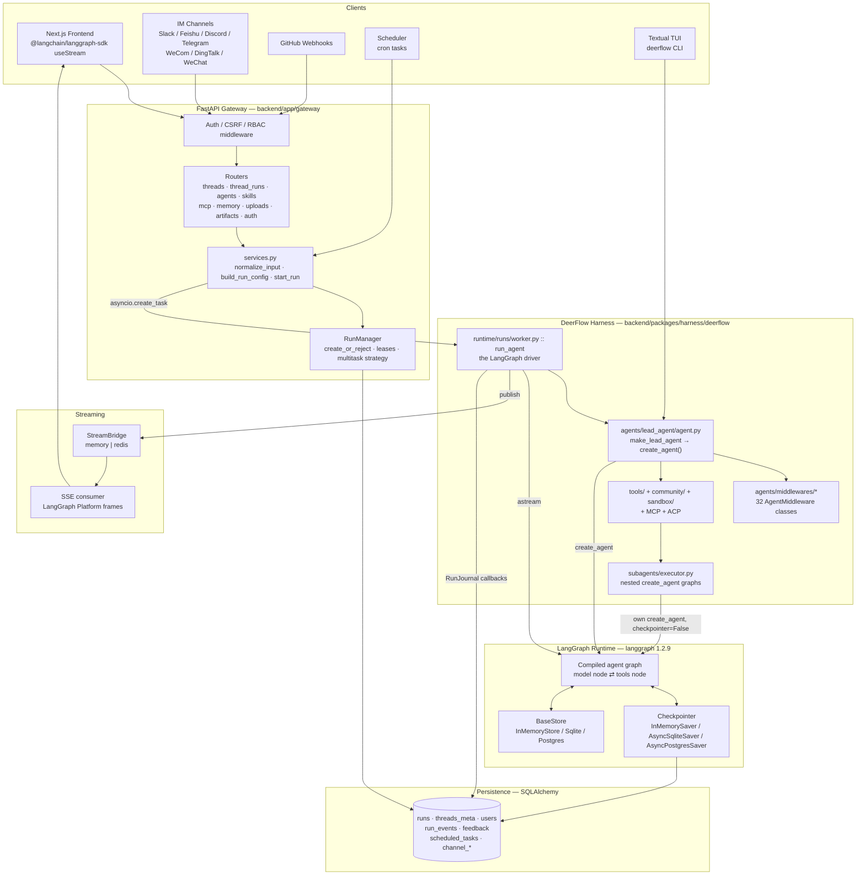

# DeerFlow Architecture Analysis

A code-level analysis of **DeerFlow v2.1.0** (ByteDance, `github.com/bytedance/deer-flow`)
answering one question in depth:

> **Does DeerFlow use LangGraph, and if so, how?**

Short answer: **yes, completely.** DeerFlow is not "an app that calls an LLM". It is a
**harness built on top of LangGraph + LangChain v1 agents**. Every user turn is a LangGraph
graph invocation; every cross-cutting concern (prompt hygiene, memory, budgets, safety,
delegation, sandboxing) is a **LangChain `AgentMiddleware`**; all conversation history is
**LangGraph checkpointer state**; the HTTP API is a **re-implementation of the LangGraph
Platform runs protocol** so the official `useStream` React hook works unmodified.

---

## Reading order

| # | Document | What it covers |
|---|----------|----------------|
| 00 | **README.md** (this file) | Executive summary, versions, top-level architecture diagram, repo map |
| 01 | [LangGraph Usage](01-langgraph-usage.md) | Exactly which LangGraph/LangChain primitives are used and where: `create_agent`, `AgentState`, reducers, `Command`, `Runtime`, `DeltaChannel`, `StateGraph`, checkpointers, `BaseStore`, stream modes |
| 02 | [Request Lifecycle](02-request-lifecycle.md) | End-to-end trace of one user prompt: HTTP → run record → agent build → graph stream → SSE → frontend |
| 03 | [Middleware Stack](03-middleware-stack.md) | All 32 middlewares: build order, hook types, execution order semantics, per-middleware catalog |
| 04 | [Prompt Analysis & Context Engineering](04-prompt-and-context.md) | How the prompt is analysed: system prompt assembly, injection defence, slash-skill activation, dynamic/durable context, summarization |
| 05 | [Tools, Tool Calling & MCP](05-tools-and-mcp.md) | Tool registry, binding, the tool-call loop, deferred tools, MCP, per-tool guards |
| 06 | [Memory, Chat History & Checkpoints](06-memory-checkpoints-state.md) | Thread state, checkpointer backends, full vs delta mode, long-term memory, store, rollback/regenerate/branching |
| 07 | [Subagents & Delegation](07-subagents-delegation.md) | The `task` tool, `SubagentExecutor`, nested graphs, delegation ledger, budgets |
| 08 | [Sandbox & Execution Safety](08-sandbox-and-safety.md) | Sandbox providers, guardrails, authz, read-before-write, audit |
| 09 | [Frontend & SSE Contract](09-frontend-sse-contract.md) | LangGraph Platform protocol compatibility, event schema, `useStream`, resumption |

---

## Verified dependency versions

From [backend/uv.lock](../../backend/uv.lock) and [backend/packages/harness/pyproject.toml](../../backend/packages/harness/pyproject.toml):

| Package | Version | Role |
|---------|---------|------|
| `langgraph` | **1.2.9** (pinned `>=1.2.9,<1.3`) | Graph runtime, checkpointing, streaming, `Command`, `Runtime`, `DeltaChannel` |
| `langchain` | **1.3.14** (`>=1.3`) | `create_agent`, `AgentMiddleware`, `AgentState`, `ModelRequest`/`ModelResponse` |
| `langchain-core` | **1.4.9** | Messages, tools, callbacks, runnables |
| `langgraph-checkpoint-sqlite` | `>=3.1.0,<3.2` | `AsyncSqliteSaver` / `SqliteSaver` |
| `langgraph-checkpoint-postgres` | optional extra | `AsyncPostgresSaver` / `PostgresSaver` |
| `langgraph-sdk` | `>=0.1.51` | Protocol types (backend), `useStream` client (frontend `^1.5.3`) |
| `langgraph-api`, `langgraph-cli`, `langgraph-runtime-inmem` | — | Dev/LangGraph-Server compatibility |
| `langchain-mcp-adapters` | `>=0.2.2` | MCP servers as LangChain tools |
| `langchain-openai` / `-anthropic` / `-deepseek` / `-google-genai` | — | Model providers |
| `langfuse` | `>=3.4.1` | Tracing |

> The project's own description in [backend/pyproject.toml](../../backend/pyproject.toml) reads:
> *"LangGraph-based AI agent system with sandbox execution capabilities"*.

---

## The one-paragraph summary

A user prompt arrives at `POST /api/threads/{thread_id}/runs/stream`. The gateway
normalises it into LangChain messages, builds a `RunnableConfig`, creates a durable
**run record**, and launches a background task. That task calls
[`make_lead_agent(config)`](../../backend/packages/harness/deerflow/agents/lead_agent/agent.py),
which composes up to 32 `AgentMiddleware` instances, resolves the model and tool set, and calls
LangChain's **`create_agent(...)`** — producing a compiled LangGraph `Pregel` graph with a
model node, a tools node, and the middleware hooks woven in. The worker attaches the
**checkpointer** and **store**, installs a `Runtime` context, registers a `RunJournal`
callback handler, and drives the graph with `agent.astream(...)` across multiple
`stream_mode`s. Each emitted chunk is published to a **StreamBridge** (in-memory or Redis),
which a separate SSE generator drains to the browser in LangGraph Platform frame format.
Conversation history is never stored by DeerFlow directly — it *is* the LangGraph
checkpoint for that `thread_id`. After the turn, the worker can run **hidden goal-continuation
turns**, persist token usage, record workspace diffs, and publish the terminal `end` frame.

---

## Top-level architecture



---

## Repository map (what matters for this analysis)

```
deer-flow/
├── backend/
│   ├── app/                               FastAPI gateway (thin)
│   │   ├── gateway/
│   │   │   ├── app.py                     lifespan: builds checkpointer/store/bridge
│   │   │   ├── deps.py                    langgraph_runtime() — all singletons
│   │   │   ├── services.py                normalize_input, build_run_config, start_run, sse_consumer
│   │   │   └── routers/thread_runs.py     LangGraph Platform runs API
│   │   ├── channels/                      Slack, Feishu, Discord, Telegram, WeCom, DingTalk, WeChat
│   │   └── scheduler/
│   └── packages/harness/deerflow/         ← THE ACTUAL AGENT (≈80k LOC Python)
│       ├── agents/
│       │   ├── lead_agent/agent.py        make_lead_agent → create_agent()
│       │   ├── lead_agent/prompt.py       SYSTEM_PROMPT_TEMPLATE (52 KB)
│       │   ├── thread_state.py            ThreadState / DeltaThreadState + reducers
│       │   ├── middlewares/               39 files, 612 KB, 30 middleware classes
│       │   └── memory/                    pluggable long-term memory
│       ├── runtime/
│       │   ├── runs/worker.py             run_agent() — the astream driver (1659 lines)
│       │   ├── runs/manager.py            RunManager (1451 lines)
│       │   ├── checkpointer/              sync + async checkpointer providers
│       │   ├── store/                     sync + async BaseStore providers
│       │   ├── stream_bridge/             memory + redis fan-out
│       │   ├── events/store/              RunEventStore (db / jsonl / memory)
│       │   ├── checkpoint_mode.py         full vs delta freeze + fail-closed gate
│       │   ├── checkpoint_state.py        CheckpointStateAccessor
│       │   ├── journal.py                 RunJournal LangChain callback handler
│       │   └── goal.py                    hidden goal-continuation loop
│       ├── subagents/executor.py          nested agents
│       ├── tools/                         registry, builtins, deferred/tool_search
│       ├── community/                     18 integrations (Tavily, Exa, Firecrawl, E2B, …)
│       ├── sandbox/                       Local / E2B / AIO sandbox providers
│       ├── skills/                        SKILL.md system + security scanner
│       ├── mcp/                           MCP client, session pool, OAuth, cache
│       ├── guardrails/ authz/             policy enforcement
│       ├── persistence/                   SQLAlchemy models + repositories
│       ├── tracing/                       Langfuse / LangSmith / Monocle
│       └── checkpoint_patches.py          upstream LangGraph bug workaround
├── frontend/                              Next.js + @langchain/langgraph-sdk
└── config.yaml                            122 KB — models, tools, every subsystem
```

---

## Ten things that make this architecture unusual

1. **No hand-written `StateGraph` for the agent.** The agent graph comes entirely from
   LangChain's `create_agent`. `StateGraph` appears exactly once in the harness — to build
   a *single-node no-op graph* used for out-of-band state mutation
   ([checkpoint_state.py](../../backend/packages/harness/deerflow/runtime/checkpoint_state.py)).
2. **Middleware is the architecture.** 612 KB of middleware vs 36 KB of agent
   factory. Features are added by appending an `AgentMiddleware`, not by adding graph nodes.
3. **Dual checkpoint representation.** A process-frozen `full` vs `delta` mode, where
   `delta` swaps the `messages` channel for a LangGraph `DeltaChannel`, with a fail-closed
   compatibility gate on every read and write.
4. **The gateway re-implements LangGraph Platform.** Same routes, same SSE frames, same
   `Content-Location` header — so the official `useStream` hook works with zero adaptation.
5. **Hidden continuation turns.** After the user-visible turn ends, a goal evaluator LLM
   can re-enter the graph for up to 8 more turns without the user sending anything.
6. **The system prompt is deliberately static.** Per-user/per-day content is injected as a
   `<system-reminder>` message instead, purely to maximise provider prefix-cache hits.
7. **Prompt-injection defence is a middleware.** User text is tag-escaped and wrapped in
   `--- BEGIN USER INPUT ---` markers at the outermost `wrap_model_call` layer.
8. **Tool schemas can be hidden from the model.** Deferred MCP tools are withheld from
   binding until a `tool_search` call promotes them into checkpointed state.
9. **Every runaway path has a deterministic cap** that *does not raise* — loop detection,
   token budget, subagent limits and safety termination all strip `tool_calls` so the run
   ends with a real answer plus a `stop_reason`.
10. **Rollback is a checkpoint fork.** Cancelling a run can restore the exact pre-run
    checkpoint by replaying materialized state through a synthetic mutation graph.
